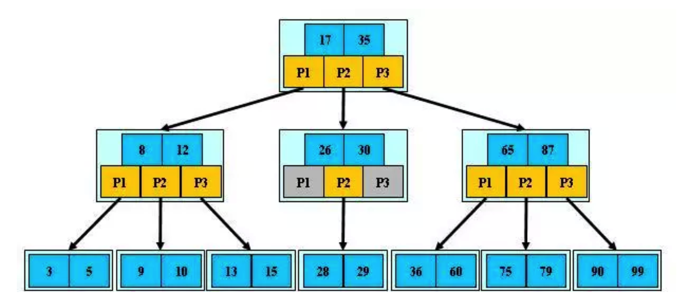
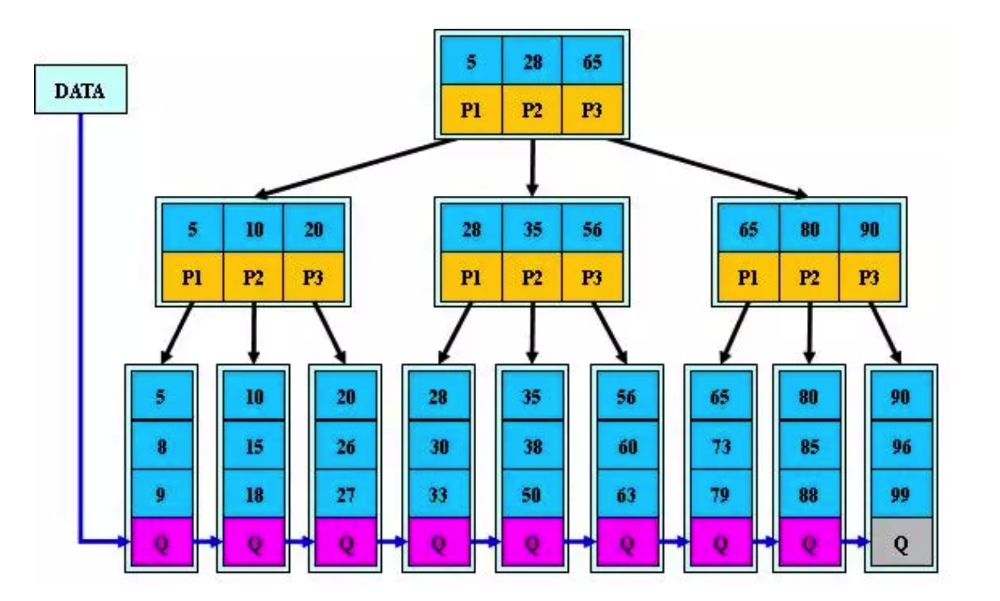
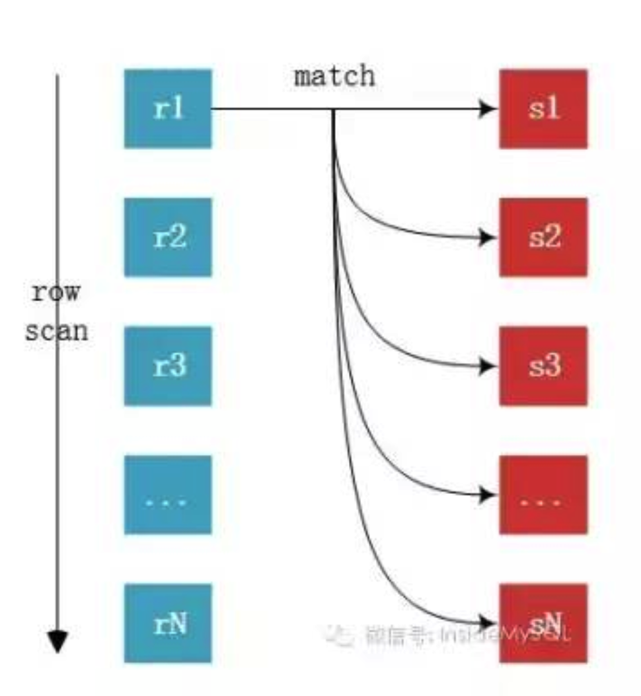
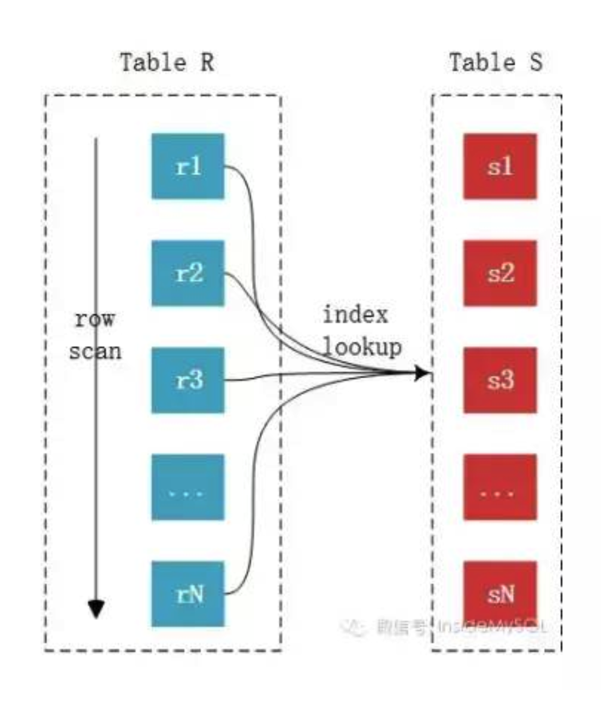
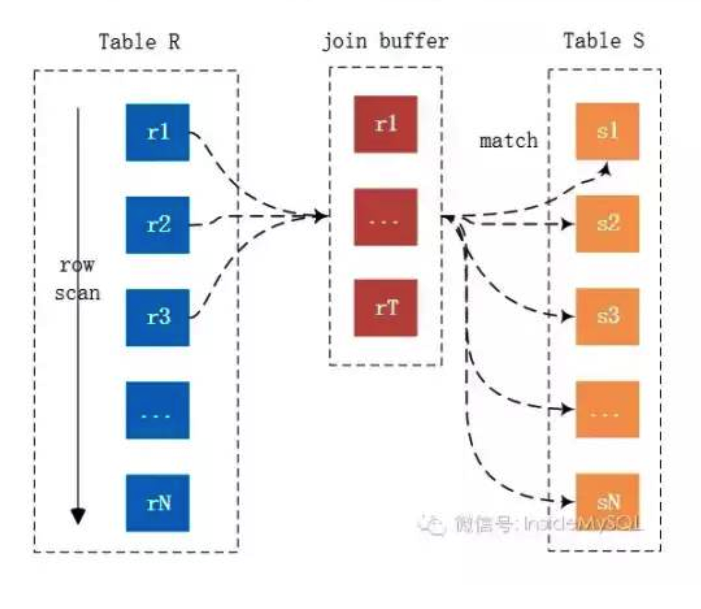

## MySQL基础

### 1. MySQL用的是什么数据结构存储

在InnoDB中，表都是根据主键顺序以索引的形式存放的，这种存储方式的表称为索引组织表。每一个索引在InnoDB里面对应一棵B+树。

### 2. MySQL数据库事务的隔离级别

- 读未提交(READ UNCOMMITTED)：一个事务还没提交时，它做的变更就能被别的事务看到。会出现事务读到其它未提交事务的数据的现象，即 **脏读**。

- 读提交(READ COMMITTED)：一个事务提交之后，它做的变更才会被其他事务看到。会出现一个事务多次读取结果不一样的现象，即 **不可重复读**。
- 可重复读(REPEATABLE READ)：MySQL 默认的隔离级别，在同一个事务里， select 的结果是事务开始时时间点的状态，因此，同样的 select操作读到的结果会是一致的，但是，会出现 **幻读** 现象。MySQL 的 InnoDB 引擎可以通过 `next-key locks` 机制来避免幻读。

- 串行化(SERIALIZABLE)：对于同一行记录，“写”会加“写锁”，“读”会加“读锁”。当出现读写锁冲突的时候，后访问的事务必须等前一个事务执行完成，才能继续执行。该隔离级别下事务都是串行顺序执行的，MySQL 数据库的 InnoDB 引擎会给读操作隐式加一把读共享锁，从而避免了脏读、不可重读复读和幻读问题。

| 隔离级别 | 脏读       | 不可重复读 | 幻读       |
| -------- | ---------- | ---------- | ---------- |
| 读未提交 | 可以出现   | 可以出现   | 可以出现   |
| 读提交   | 不允许出现 | 可以出现   | 可以出现   |
| 可重复读 | 不允许出现 | 不允许出现 | 可以出现   |
| 串行化   | 不允许出现 | 不允许出现 | 不允许出现 |

### 3. 事务隔离级别的实现

在MySQL中，实际上每条记录在更新的时候都会同时记录一条回滚操作（Undo Log）记录上的最新值，通过回滚操作，都可以得到前一个状态的值。MVCC的实现,是通过保存数据在某个时间点的快照来实现的。不同时刻启动的事务会有不同的 read-view 。每条记录在更新的时候都会同时记录一条回滚操作。同一条记录在系统中可以存在多个版本，这就是数据库的多版本并发控制（MVCC）。

**MVCC(Multi-Version Concurrency Control)，多版本并发控制。MVCC是一种并发控制的方法，一般在数据库管理系统中，实现对数据库的并发访问；在编程语言中实现事务内存。**

MVCC 在读已提交（Read Committed）和可重复读（Repeatable Read）隔离级别下起作用。

MVCC 使用了一种不同的手段，每个连接到数据库的读者，在某个瞬间看到的是数据库的一个快照，写操作造成的变化在写操作完成之前（或者数据库事务提交之前）对于其他的读操作来说是不可见的。

在MySQL中建表时，每个表都会有三列隐藏记录，其中和MVCC有关系的有两列:

- **数据行的版本号** (DATA_TRX_ID)：记录最近更新这条行记录的事务 ID，大小为6个字节

- **回滚指针** (DATA_ROLL_PTR)：表示指向该行回滚段rollback segment的指针，大小为7个字节，InnoDB通过这个指针找到之前版本的数据。该行记录上所有旧版本，在undo.log中都通过链表的形式组织

  另外，每条记录的头信息record header里都有一个专门的 bit（deleted_flag）来表示当前记录是否已经被删除

**插入逻辑流程** ：全局事务ID记录到列 DATA_TRX_ID 中去

**删除逻辑流程** ：数据并没有被真正删除，而是对删除版本号做改变，DATA_ROLL_PTR指向执行删除操作的事务ID

**修改逻辑流程** ：修改逻辑和删除逻辑有点相似，修改数据的时候会先复制一条当前记录行数据，同时标记这条数据的数据行版本号为当前是事务版本号，最后把原来的数据行的删除版本号标记为当前是事务

**查询逻辑流程** ：

- 查找数据行版本号早于当前事务版本号的数据行记录。也就是说，数据行的版本号要小于或等于当前事务的系统版本号，这样也就确保了读取到的数据是当前事务开始前已经存在的数据，或者是自身事务改变过的数据。

- 查找删除版本号要么为NULL，要么大于当前事务版本号的记录。这样确保查询出来的数据行记录在事务开启之前没有被删除。

InnoDB实现MVCC的方式是：

- 事务以排他锁的形式修改原始数据

- 把修改前的数据存放于undo log，通过回滚指针与主数据关联

- 修改成功（commit）啥都不做，失败则恢复undo log中的数据（rollback）

### 4. B+树和B树，为什么MySQL索引使用B+树

MySQL选用B+树这种数据结构作为索引，可以提高查询索引时的磁盘IO效率，并且可以提高范围查询的效率，并且B+树里的元素也是有序的。

**B树**的定义：

1. 根结点至少有两个子节点
2. 每个非叶子节点（根节点除外）最少有m/2个子节点，即内部节点的子节点个数最少也有m/2个
3. 有k个关键字(关键字按递增次序排列)的非叶结点恰好有k+1个孩子
4. 所有叶子节点在同一层，即所有叶子几点高度一致

**B+树**是从B树的变体。跟B树的不同：

1. B+树非叶子节点不存放数据，只存放keys（索引数据）
2. B+树的叶子节点之间存在指针相连，而且是单链表
3. 有k个关键字(关键字按递增次序排列)的非叶结点恰好有k个孩子

|                                   | B树                              | B+树                                                         |
| --------------------------------- | -------------------------------- | ------------------------------------------------------------ |
| 具有n个关键字的节点包含的子树个数 | n+1                              | n                                                            |
| m阶树关键字个数n的取值范围        | [m/2-1,m-1]                      | [m/2,m]                                                      |
| 叶子结点                          | 关键字是不重复的                 | 包含全部关键字                                               |
| 为什么用B+树                      | 每个关键字对应一个记录的存储地址 | 非叶子节点仅起到索引作用，节点中的每个索引项含对应子树的最大关键字和指向该子树的指针 |
| 指针                              | 无                               | 两个（根节点、最小叶子节点）                                 |

**为什么说B+树比B树更适合数据库索引？**

1. B+树的磁盘读写代价更低：B+树只有叶节点存放数据，其余节点用来索引，而B树是每个索引节点都会有Data域，因此其内部节点相对B树更小，如果把所有同一内部节点的关键字存放在同一盘块中，那么盘块所能容纳的关键字数量也越多，一次性读入内存的需要查找的关键字也就越多，相对IO读写次数就降低了。

2. B+树的查询效率更加稳定：由于非叶结点并不是最终指向文件内容的结点，而只是叶子结点中关键字的索引。所以任何关键字的查找必须走一条从根结点到叶子结点的路。所有关键字查询的路径长度相同，导致每一个数据的查询效率相当。

3. 由于B+树的数据都存储在叶子结点中，分支结点均为索引，方便扫库，只需要扫一遍叶子结点即可，但是B树因为其分支结点同样存储着数据，我们要找到具体的数据，需要进行一次中序遍历按序来扫，所以B+树更加适合在区间查询的情况。

### 5. 数据库的主键索引和普通索引的区别

索引是在存储引擎层实现的。主键索引的叶子节点存的是整行数据。非主键索引的叶子节点内容是主键的值。

- 主键查询方式：`select * from T where id=100`，只需要搜索id这颗B+树
- 普通索引查询方式：`select * from T where k=200`，需要先搜索k索引对应的B+树，得到主键id为100，再到主键id索引搜索一次，这个过程称作**回表**

### 6. 为什么普通索引/二级索引/辅助索引存主键不直接存数据位置

1. 数据迁移角度：如果二级索引存储的是物理地址，那么当数据发生迁移的时候，原来的物理地址到新的环境中就基本gg了

2. 页变换角度：页分裂和页合并会导致物理地址产生变化

### 7. 索引是越多越好吗，索引建多了会有什么问题

索引除了要占据存储空间之外，在进行插入，更新和删除操作时也需要对索引进行操作

- 高频查询，可以建立联合索引来使用覆盖索引，不用回表

- 非高频查询，在已有的联合索引基础上，使用最左前缀原则来快速查询

### 8. 数据库索引什么情况失效

1. 条件中用or，即使其中有条件带索引，也不会使用索引查询(注意：使用or，又想索引生效，只能将or条件中的每个列都加上索引)

2. 对于联合索引，不是使用的第一部分(第一个)，则不会使用索引

3. like的模糊查询以%开头，索引失效

4. SQL在查询的时候，调用了SQL函数或执行了运算

5. 如果列类型是字符串，那一定要在条件中将数据使用引号引用起来，否则不会使用索引

6. 如果MySQL估计使用全表扫描要比使用索引快,则不使用索引（如果要走c字段索引的话，系统会预测走c字段索引大概需要扫描多少行。如果预测到要扫描的行数很多，它可能就不走索引而直接扫描全表了。）

系统是通过 **索引的区分度** 来判断的，一个索引上不同的值越多，意味着出现相同数值的索引越少，意味着索引的区分度越高。我们也把区分度称之为基数，一个索引的基数越大，意味着走索引查询越有优势。那么问题来了，怎么知道这个索引的基数呢？系统当然是不会遍历全部来获得一个索引的基数的，代价太大了，索引系统是通过遍历部分数据，也就是通过采样的方式，来预测索引的基数的。

**性别上建索引会怎么样？**

可选项太少，查完之后只能排除一半，还要继续扫描。如果用在联合索引里面，应该放最右边

### 9. 索引覆盖、最左匹配原则、索引下推

- **索引覆盖**：在一个查询里面，索引 k 已经“覆盖了”我们的查询需求，不需要回表，我们称为覆盖索引

- **最左匹配原则**：在MySQL建立联合索引时会遵循最左前缀匹配的原则，即最左优先，在检索数据时从联合索引的最左边开始匹配:

联合索引`(col1,col2,col3)`实际建立了`(col1)`、`(col1,col2)`、`(col,col2,col3)`三个索引

- **索引下推**： 可以在索引遍历过程中，对索引中包含的字段先做判断，直接过滤掉不满足条件的记录，减少回表次数

### 10. MySQL全局锁、表锁、行锁

1. **全局锁**：全局锁就是对整个数据库实例加锁Flush tables with read lock.

2. **表锁** ：MySQL 里面表级别的锁有两种：一种是表锁，一种是元数据锁（meta data lock，MDL).

3. **行锁** ：在引擎层由各个引擎自己实现的。

#### Innodb行锁的算法

InnoDB 存储引擎使用三种行锁的算法用来满足相关事务隔离级别的要求。

- **Record Locks**

  该锁为索引记录上的锁，如果表中没有定义索引，InnoDB 会默认为该表创建一个隐藏的聚簇索引，并使用该索引锁定记录。

- **Gap Locks**

  该锁会锁定一个范围，但是不括记录本身。可以通过修改隔离级别为 `READ COMMITTED` 或者配置 `innodb_locks_unsafe_for_binlog` 参数为 `ON` 。

- **Next-key Locks**

  该锁就是 Record Locks 和 Gap Locks 的组合，即锁定一个范围并且锁定该记录本身。InnoDB 使用 Next-key Locks 解决幻读问题。需要注意的是，如果索引有唯一属性，则 InnnoDB 会自动将 Next-key Locks 降级为 Record Locks。举个例子，如果一个索引有 1, 3, 5 三个值，则该索引锁定的区间为 `(-∞,1], (1,3], (3,5], (5,+ ∞)` 。

### 11. 互斥锁和同步锁

- **互斥锁**（排它锁、独占锁、写锁、X锁）：若事务T对数据对象A加上了X锁，则只允许T读取和修改A，其他务都不能再对A加任何类型的锁，直到T释放A上的锁为止。

- **共享锁**（读锁、S锁）：若事务T对数据对象A加上了S锁，则事务T可以读A但是不能修改A，其他事物只能再对A加S锁，而不能加X锁，直到T释放A上的S锁为止。

### 12. 乐观锁和悲观锁

| 悲观锁                                                       | 乐观锁                                                       |
| ------------------------------------------------------------ | ------------------------------------------------------------ |
| 总是假设最坏的情况，每次去拿数据的时候都认为别人会修改，所以每次在拿数据的时候都会上锁，这样别人想拿这个数据就会阻塞直到它拿到锁 | 总是假设最好的情况，每次去拿数据的时候都认为别人不会修改，所以不会上锁，但是在更新的时候会判断一下在此期间别人有没有去更新这个数据 |
| 假定会发生并发冲突，屏蔽一切可能违反数据完整性的操作         | 假设不会发生并发冲突，只在提交操作时检查是否违反数据完整性   |
| synchronized和ReentrantLock                                  | 版本号控制，CAS                                              |
| 适用于数据一致性比较高的场景                                 | 只用在高并发、多读少写的场景                                 |

只要更新数据是依赖读取的数据作为基础条件的，就会有并发更新问题，需要乐观锁或者悲观锁取解决，特别是在计数表现明显。

数据库的乐观锁需要自己实现：

- 使用数据版本（Version）记录机制实现：在表里面添加一个 version 字段，每次修改成功值加 1，这样每次修改的时候先对比一下，自己拥有的 version 和数据库现在的 version 是否一致，如果不一致就不修改，这样就实现了乐观锁。

- 使用时间戳

#### 乐观锁和悲观锁在Java和MySQL分别是怎么实现的？

|        | 乐观锁               | 悲观锁                                              |
| ------ | -------------------- | --------------------------------------------------- |
| Java   | CAS,AutomaticInteger | synchronized                                        |
| 数据库 | 基于版本机制         | 关闭数据库的自动提交属性，使用` SELECT……FOR UPDATE` |

### 13. 死锁

**死锁** 是指两个或两个以上的进程在执行过程中，由于竞争资源或者由于彼此通信而造成的一种阻塞的现象，若无外力作用，它们都将无法推进下去。此时称系统处于死锁状态或系统产生了死锁，这些永远在互相等待的进程称为死锁进程。

InnoDB 引擎采取的是 `wait-for graph` 等待图的方法来自动检测死锁，如果发现死锁会自动回滚一个事务。

**预防死锁：**

- 一次封锁法：要求事务必须一次将所有要使用的数据全部加锁，否则就不能继续执行

- 顺序封锁法：预先对数据对象规定一个封锁顺序，所有事务都按照这个顺序实施封锁

**死锁的诊断：**

- 超时法：如果一个事务的等待时间超过了规定的时限，就认为发生了死锁

- 等待图法：存在回路则说明发生死锁(Innodb)

**死锁的解除：**

- 直接进入等待，直到超时

- 发起死锁检测，发现死锁后，主动回滚死锁链条中的某一个事务

**银行家算法：** 

仅当申请者可以在一定时间内无条件的归还他所申请的全部资源时，才能把资源分配给它。

### 14. InnoDB和MyISAM的区别

|              | MyISAM                                                       | InnoDB                                                       |
| ------------ | ------------------------------------------------------------ | ------------------------------------------------------------ |
| 支持的锁级别 | 只支持表级锁                                                 | 全局锁、表锁、行锁                                           |
| 是否支持外键 | 不支持外键                                                   | 支持外键                                                     |
| 是否支持事务 | 不支持事务，但每次查询都是原子操作                           | 支持事务                                                     |
| 选择场景     | 如果执行大量的select，insert，MyISAM比较适合                 | 如果有大量的update和insert，建议使用InnoDB                   |
| 索引         | 采用非聚集索引，索引文件的数据域存储指向数据文件的指针。辅索引与主索引基本一致，但是辅索引不用保证唯一性。 | 主键索引采用聚集索引（索引的数据域存储数据文件本身），辅索引的数据域存储主键的值。从辅索引查找数据，需要先通过辅索引找到主键值，再访问主索引(回表) |

### 15. 一张自增表里面总共有 7 条数据，删除了最后 2 条数据，重启 MySQL 数据库，又插入了一条数据，此时 id 是几？

- 表类型如果是 MyISAM，那 id 就是 8

- 表类型如果是 InnoDB，那 id 就是 6。

InnoDB 表只会把自增主键的最大 id 记录在内存中，所以重启之后会导致最大 id 丢失。

### 16. SQL语句怎么执行的

### 17. 解释一下join

**内连接**：inner join，把匹配的关联数据显示出来

**左连接**：left join，左边的表全部显示出来，右边的表显示出符合条件的数据，缺失则为null

**右连接**：right join，右边的表全部显示出来，左边的表显示出符合条件的数据，缺失则为null

####  join的底层原理

（1）Simple Nested-Loop Join（简单嵌套）：r为驱动表，s为匹配表，可以看到从r中分别取出r1、r2、......、rn去匹配s表的左右列，然后再合并数据，对s表进行了rn次访问，对数据库开销大

（2）Index Nested-Loop Join（索引嵌套）：这个要求非驱动表（匹配表s）上有索引，可以通过索引来减少比较，加速查询。在查询时，驱动表（r）会根据关联字段的索引进行查找，当在索引上找到符合的值，再回表进行查询，也就是只有当匹配到索引以后才会进行回表查询。如果非驱动表（s）的关联健是主键的话，性能会非常高，如果不是主键，要进行多次回表查询，先关联索引，然后根据二级索引的主键ID进行回表操作，性能上比索引是主键要慢。

（3）Block Nested-Loop Join（块嵌套）：如果有索引，会选取第二种方式进行join，但如果join列没有索引，就会采用Block Nested-Loop Join。可以看到中间有个join buffer缓冲区，是将驱动表的所有join相关的列都先缓存到join buffer中，然后批量与匹配表进行匹配，将第一种多次比较合并为一次，降低了非驱动表（s）的访问频率。

### 18. MySQL的主从复制原理，读写分离如何实现

主从复制的原理 : 主服务器master记录数据库操作日志到bin log，从服务器开启IO线程将二进制日志记录的操作同步到relay log（存在从服务器的缓存中）

代码层面实现读写分离（思路）：在db.properties中配置两个url，配置两个数据源。拦截器拦截判断操作为读操作还是写操作，然后选择使用哪个数据库

### 19. 数据库的三范式是什么？

- 第一范式：列的原子性，即数据库表的每一列都是不可分割的原子数据项

- 第二范式：不存在部分依赖，2NF是对记录的唯一性约束，要求记录有唯一标识，即实体的唯一性

- 第三范式：不存在传递依赖，3NF是对字段冗余性的约束，即任何字段不能由其他字段派生出来，它要求字段没有冗余

### 20. MySQL 问题排查都有哪些手段？

- 使用 show processlist 命令查看当前所有连接信息

- 使用 explain 命令查询 SQL 语句执行计划

- 慢查询日志：MySQL提供的一种日志记录，用来记录在MySQL中响应时间超过阀值的语句。`slow_query_log`：是否开启慢查询日志，1表示开启，0表示关闭，默认不启动；`long_query_time`的默认值为10，意思是记录运行10秒以上的语句

### 21. 数据库表的优化

1. 设计规范化表，消除数据冗余

2. 适当的冗余，减少多表连接。数据库设计的实用原则是：在数据冗余和处理速度之间找到合适的平衡点

3. 自增主键

4. 存储过程、视图、函数的适当使用

5. 分割表，减小表尺寸

6. 字段设计原则：A、数据类型尽量用数字型，数字型的比较比字符型的快很多；B、数据类型尽量小，这里的尽量小是指在满足可以预见的未来需求的前提下的；C、尽量不要允许NULL，除非必要，可以用NOT NULL+DEFAULT代替；D、少用TEXT和IMAGE，二进制字段的读写是比较慢的，而且，读取的方法也不多，大部分情况下最好不用

7. 索引

### 22. MySQL怎么做到高并发

1）代码中sql语句优化

2）数据库字段优化，索引优化

3）加缓存，redis/memcache等

4）主从复制，读写分离

5）分区表

6）垂直拆分，解耦模块

7）水平切分 

### 23. 慢SQL如何解决/SQL优化

1. 字段类型转换导致不用索引，如字符串类型的不用引号，数字类型的用引号等，这有可能会用不到索引导致全表扫描

2. MySQL 不支持函数转换，所以字段前面不能加函数，否则这将用不到索引

3. 不要在字段前面加减运算

4. like % 在前面用不到索引

5. 根据联合索引的第二个及以后的字段单独查询用不到索引

6. 不要使用`select *`

7. 排序请尽量使用升序

8. or 的查询尽量用 union 代替（Innodb）

9. 复合索引高选择性的字段排在前面

10. order by / group by 字段包括在索引当中减少排序，效率会更高

#### 一条SQL语句执行很慢的原因有哪些？

1. **数据库在刷新脏页**：在往数据库插入或者更新一条数据的时候，我们知道数据库会在内存中把对应的字段更新了，但是更新之后，这些更新的字段并不会马上同步持久化到磁盘中，而是把这些更新的记录写入到redo log日志中去，等到空闲的时候，再通过redo log日志把最新的数据同步到磁盘中去。刷脏页有以下几种场景（1）redo log 日志写满了：redo log日志里的内容是很有限的，如果数据库一直很忙，更新又很频繁，这个时候redo log很快就被写满了，这个时候就没办法等到空闲的时候再把数据同步到磁盘中去，只能暂停其他操作，把数据同步到磁盘中，而此时就会导致平时正常的SQL语句突然执行的很慢。（2）内存不够用了：如果一次性查询较多的数据，而且恰好碰到所查询的数据页不在内存中，需要申请内存，而此时恰好内存不足的时候就要淘汰一部分内存数据页，如果是干净页就直接释放，如果恰好是脏页就要刷脏页。（3）MySQL认为系统“空闲”的时候：这时候系统没什么压力。（4）MySQL正常关闭的时候：这时候，MySQL会把内存的脏页都flush到磁盘上，这样下次MySQL启动的时候，就可以直接从磁盘上读取数据，启动速度会很快。

2. **拿不到锁**： 我们要执行的这条SQL语句涉及到的表刚好别人在用，并且加锁了，我们拿不到锁，只能慢慢等待别人释放锁了。如果要判断是否真的在等待锁，可以使用 show processlist 这个命令来查看当前的状态。 

总结：一个 SQL 执行的很慢，我们要分两种情况讨论

1、大多数情况下很正常，偶尔很慢，则有如下原因

- 数据库在刷新脏页，例如 redo log 写满了需要同步到磁盘
- 执行的时候，遇到锁，如表锁、行锁。

2、这条 SQL 语句一直执行的很慢，则有如下原因

- 没有用上索引：例如该字段没有索引；由于对字段进行运算、函数操作导致无法用索引

### 24.数据库的幂等，如何实现数据库幂等的需求 

幂等性：就是用户对于同一操作发起的一次请求或者多次请求的结果是一致的，不会因为多次点击而产生了副作用（表示N次变换和1次变换的结果相同）。

1. 全局唯一ID：如果使用全局唯一ID，就是根据业务的操作和内容生成一个全局ID，在执行操作前先根据这个全局唯一ID是否存在，来判断这个操作是否已经执行。如果不存在则把全局ID，存储到存储系统中，比如数据库、Redis等。如果存在则表示该方法已经执行。

2. 去重表：适用于在业务中有唯一标的插入场景中，比如在以上的支付场景中，如果一个订单只会支付一次，所以订单ID可以作为唯一标识。这时，我们就可以建一张去重表，并且把唯一标识作为唯一索引，在我们实现时，把创建支付单据和写入去去重表，放在一个事务中，如果重复创建，数据库会抛出唯一约束异常，操作就会回滚。

3. 多版本控制：这种方法适合在更新的场景中，比如我们要更新商品的名字，这时我们就可以在更新的接口中增加一个版本号，来做幂等。

4. 分布式锁：在业务系统插入数据或者更新数据，获取分布式锁，然后做操作，之后释放锁，这样其实是把多线程并发的锁的思路，引入多个系统，也就是分布式系统中得解决思路

5. 状态机幂：就是业务单据上面有个状态，状态在不同的情况下会发生变更，一般情况下存在有限状态机，这时候，如果状态机已经处于下一个状态，这时候来了一个上一个状态的变更，理论上是不能够变更的，这样的话，保证了有限状态机的幂等。

### 25.MySQL中的日志

MySQL Innodb中跟数据持久性、一致性有关的日志，有以下几种：

- Bin Log:是MySQL服务层产生的日志，常用来进行数据恢复、数据库复制，常见的MySQL主从架构，就是采用slave同步master的binlog实现的。

- Redo Log:记录了数据操作在物理层面的修改，MySQL中使用了大量缓存，修改操作时会直接修改内存，而不是立刻修改磁盘，事务进行中时会不断的产生redo log，在事务提交时进行一次flush操作，保存到磁盘中。当数据库或主机失效重启时，会根据redo log进行数据的恢复，如果redo log中有事务提交，则进行事务提交修改数据。

- Undo Log: 除了记录redo log外，当进行数据修改时还会记录undo log，undo log用于数据的撤回操作，它记录了修改的反向操作，比如，插入对应删除，修改对应修改为原来的数据，通过undo log可以实现事务回滚，并且可以根据undo log回溯到某个特定的版本的数据，实现MVCC。

