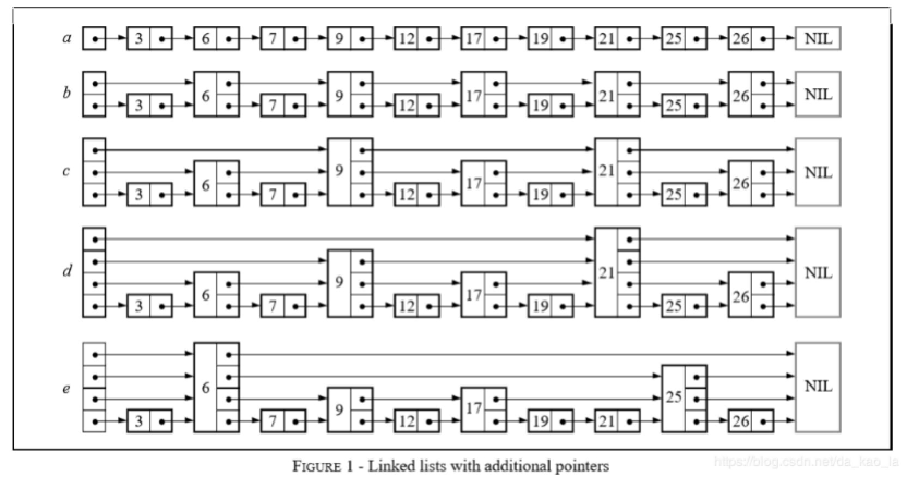
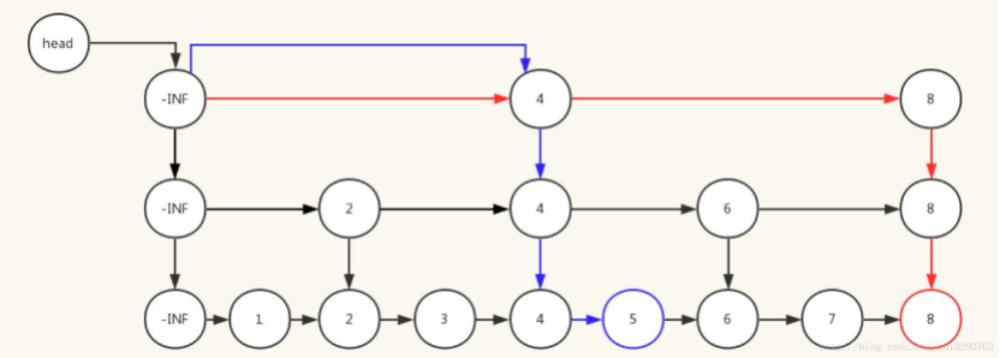
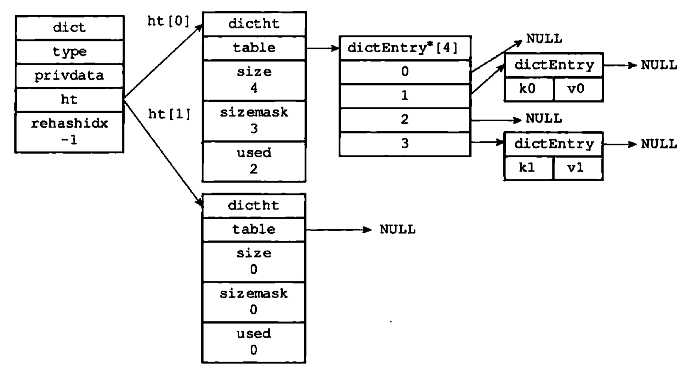
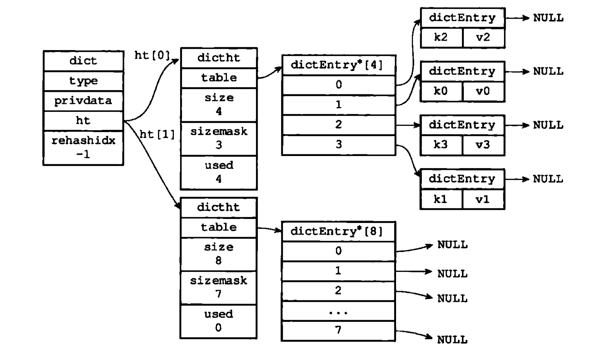
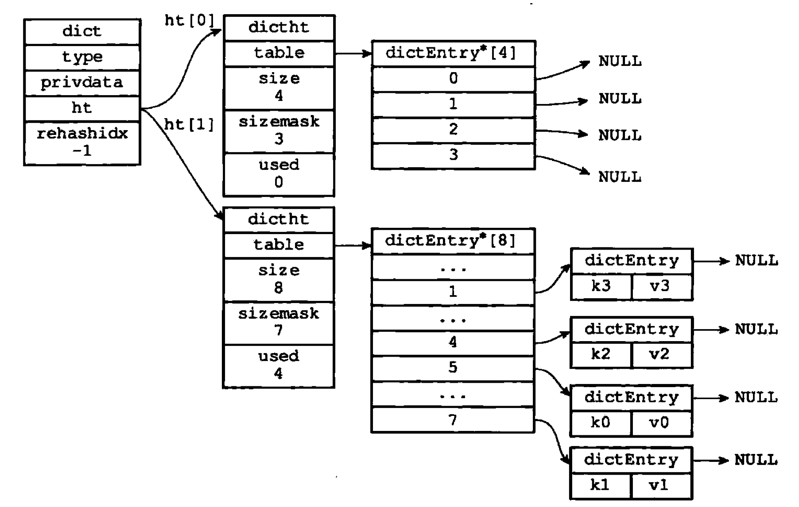
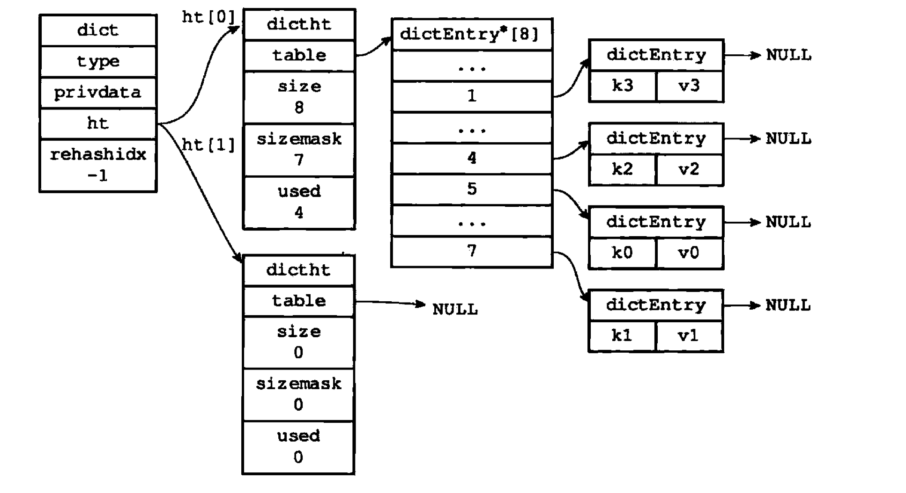
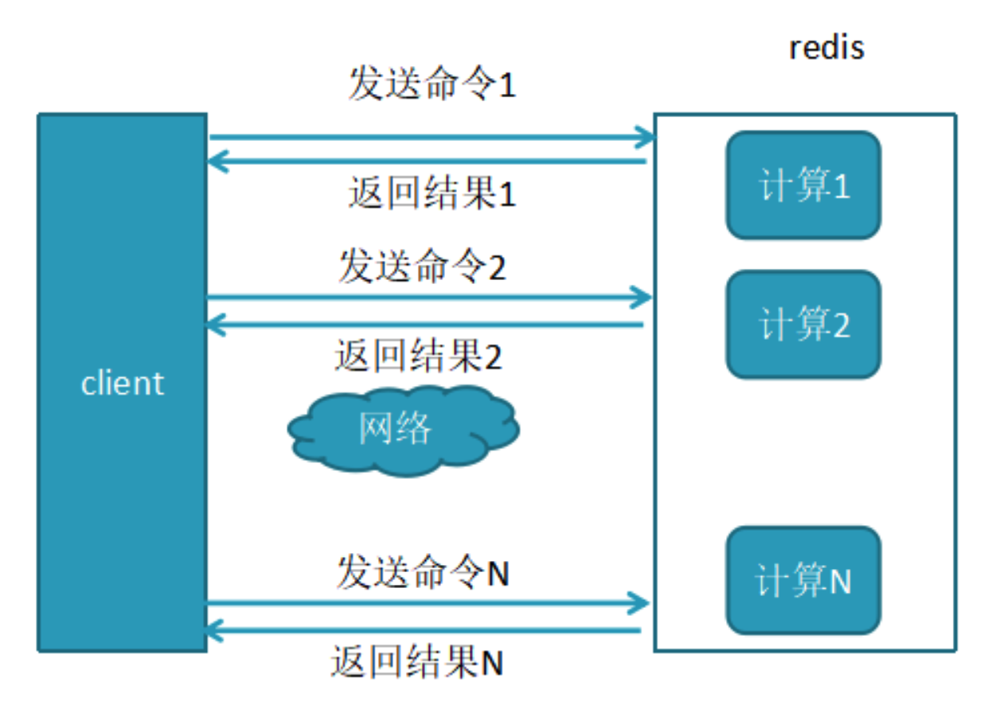
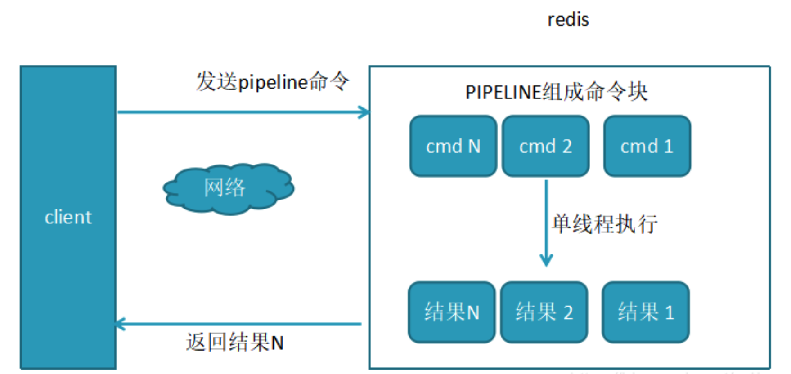
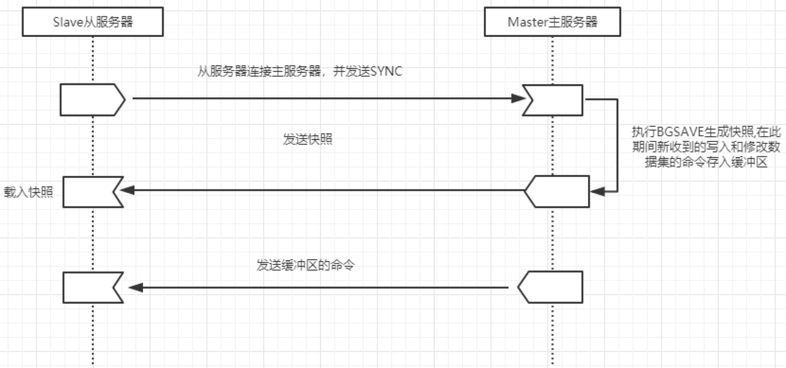

## Redis基础

#### 1.Redis数据类型

string（字符串）、list（列表）、hash（字典）、set（集合）、zset（有序集合）。

Redis 的String value值最大可以达到 512MB；

Redis 的list、set、hash最大元素(键值对)个数为2^32 -1;

#### 2.Redis底层是通过什么实现的

Redis底层数据结构有一下数据类型：

（1）**简单动态字符串(SDS)** ：string【默认字符串表示】设置一个key ='msg'，value = 'hello world'的新键值对，它们底层是数据结构将会是：键（key）是一个字符串对象，对象的底层实现是一个保存着字符串“msg” 的SDS；值（value）也是一个字符串对象，对象的底层实现是一个保存着字符串“hello world” 的SDS。

（2）**链表** ：list【列表键的底层实现之一】链表提供了高效的节点重排能力，以及顺序性的节点访问方式，并且可以通过增删节点来灵活地调整链表的长度。

（3）**字典** ：hash【哈希表的底层实现】在插入一条新的数据时，会进行哈希值的计算，如果出现了hash值相同的情况，Redis中采用了链地址法来解决键冲突。

#### 3.Redis有序列表zset底层原理

Redis有序集合zset的底层实现——跳跃表skiplist。

下图用a,b,c,d,e五种有序链表及其变式。

- [a]单链表：查询时间复杂度O(n)

- [b]level-2单链表：每隔一个节点为一个level-2节点，每个level-2节点有2个后继指针，分别指向单链表中的下一个节点和下一个level-2节点。查询时间复杂度为O(n/2)

- [c]level-3单链表：每隔一个节点为一个level-2节点，每隔4个节点为一个level-3节点，查询时间复杂度O(n/4)

- [d]指数式单链表：每2^i个节点的level为i+1，查询时间复杂度为O(log2N)

- [e]跳跃表：各个level的节点个数同指数式单链表，但出现的位置随机，查询复杂度仍然是O(log2N)吗?

#### 4.zset查找、插入、删除操作的时间复杂度？

Redis有序集合zset的底层实现——跳跃表skiplist查找的时间复杂度：跳表的索引高度h=log2n，且每层索引最多遍历3个元素。所以跳表中查找一个元素的时间复杂度为O(3*logn)，省略常数即：O(logn)。插入的时间复杂度：整个插入过程的路径与查找元素路径类似， 每层索引中插入元素的时间复杂度 O(1)，所以整个插入的时间复杂度是 O(logn)。 

**跳表查询、插入、删除的时间复杂度为O(logn)** ，与平衡二叉树接近。

#### 5.Redis选择使用跳表而不是红黑树来实现zset

Redis中的有序集合(zset) 支持的操作：插入、删除、查找、有序输出所有元素、按照范围区间查找元素（比如查找值在 [100, 356] 之间的数据）其中，前四个操作红黑树也可以完成，且时间复杂度跟跳表是一样的。但是，按照区间来查找数据这个操作，红黑树的效率没有跳表高。按照区间查找数据时，跳表可以做到 O(logn) 的时间复杂度定位区间的起点，然后在原始链表中顺序往后遍历就可以了，非常高效。 跳表是一个随机化的数据结构，实质就是一种可以进行二分查找的有序链表，跳表在原有的有序链表上面增加了多级索引，通过索引来实现快速查找，跳表不仅能提高搜索性能，同时也可以提高插入和删除操作的性能。

#### 6.Redis为什么效率高

- 完全基于内存，绝大部分请求是纯粹的内存操作，非常快速

- 采用单线程，在加锁释放锁操作，没有因为可能出现死锁而导致的性能消耗

- 数据结构简单，对数据操作也简单

- 使用非阻塞多路I/O复用模型：这里“多路”指的是多个网络连接，“复用”指的是复用同一个线程。采用多路 I/O 复用技术可以让单个线程高效的处理多个连接请求，尽量减少网络IO的时间消耗

- Redis直接自己构建了VM机制，因为调用系统函数浪费时间

#### 7.Redis为什么是单线程

因为Redis是基于内存的操作，CPU不是Redis的瓶颈，Redis的瓶颈最有可能是机器内存的大小或者网络带宽。既然单线程容易实现，而且CPU不会成为瓶颈，那就顺理成章地采用单线程的方案了（毕竟采用多线程会有很多麻烦！）。

#### 8.Redis过期策略

##### Redis过期策略是：定期删除+惰性删除

- **定期删除** ：Redis默认是每隔`100ms`就随机抽取一些设置了过期时间的key，检查其是否过期，如果过期就删除。

- **惰性删除** ：获取 key 的时候，如果此时 key 已经过期，就删除，不会返回任何东西。

#### 9.Redis内存淘汰机制

如果大量过期key堆积在内存里，导致redis内存块耗尽了，咋整？——**内存淘汰机制**

① **volatile-lru**：从已设置过期时间的数据集（server.db[i].expires）中挑选最近最少使用的数据淘汰

② **volatile-ttl**：从已设置过期时间的数据集（server.db[i].expires）中挑选将要过期的数据淘汰

③ **volatile-random**：从已设置过期时间的数据集（server.db[i].expires）中任意选择数据淘汰

④ **allkeys-lru**：当内存不足以容纳新写入数据时，在键空间中，移除最近最少使用的key（这个是最常用的）

⑤ **allkeys-random**：从数据集（server.db[i].dict）中任意选择数据淘汰

⑥ **no-eviction**：禁止驱逐数据，也就是说当内存不足以容纳新写入数据时，新写入操作会报错。这个应该没人使用吧！

*4.0版本后增加以下两种：*

⑦ **volatile-lfu**：从已设置过期时间的数据集(server.db[i].expires)中挑选最不经常使用的数据淘汰

⑧ **allkeys-lfu**：当内存不足以容纳新写入数据时，在键空间中，移除最不经常使用的key

#### 10.Redis持久化

Redis支持RDB和AOF两种持久化机制，持久化功能有效地避免因进程退出造成的数据丢失问题，当下次重启时利用之前持久化的文件即可实现数据恢复。

**RDB持久化** ：指定的时间间隔能对数据进行快照存储。【数据】

**AOF持久化** ：记录每次对服务器写的操作,当服务器重启的时候会重新执行这些命令来恢复原始的数据, 每一个收到的写命令都通过write函数追加到文件中。【日志】

#### 11.AOF文件比较大怎么办

Redis可以在AOF文件体积变得过大时，自动地在后台对AOF进行重写：重写后的新AOF文件包含了恢复当前数据集所需的最小命令集合。整个重写操作是绝对安全的，因为Redis在创建新AOF文件的过程中，会继续将命令追加到现有的AOF文件里面，即使重写过程中发生停机，现有的AOF文件也不会丢失。而一旦新AOF文件创建完毕，Redis就会从旧AOF文件切换到新AOF文件，并开始对新 AOF文件进行追加操作。

执行`BGREWRITEAOF`命令对Redis的AOF进行重写。

(1) 随着AOF文件越来越大里面会有大部分是重复命令或者可以合并的命令（100次incr = set key 100）

(2) 重写的好处：减少AOF日志尺寸，减少内存占用，加快数据库恢复时间。执行一个 AOF文件重写操作，重写会创建一个当前 AOF文件的体积优化版本。

#### 12.缓存击穿，缓存穿透，缓存雪崩

|          | 缓存穿透                                                     | 缓存雪崩                                                     | 缓存击穿                                                     |
| -------- | ------------------------------------------------------------ | ------------------------------------------------------------ | ------------------------------------------------------------ |
| 概念     | 大量请求的 key 根本不存在于缓存中，导致请求直接到了数据库上，根本没有经过缓存这一层 | 缓存时采用了相同的过期时间，导致缓存在某一时刻同时失效，请求全部转发到DB | 高并发的系统中，大量的请求同时查询一个key时，此时这个key正好失效了，就会导致大量的请求都打到DB上面去(热点key失效) |
| 解决方案 | ①缓存无效key②Bloom-Filter                                    | 设置不同的过期时间①事前：尽量保证整个Redis集群的高可用性，发现机器宕机尽快补上。选择合适的内存淘汰策略②事中：本地ehcache缓存+hystrix限流&降级，避免MySQL崩掉③事后：利用Redis持久化机制保存的数据尽快恢复缓存 | 以在第一个查询数据的请求上使用一个互斥锁来锁住它。其他的线程走到这一步拿不到锁就等着，等第一个线程查询到了数据，然后做缓存。后面的线程进来发现已经有缓存了，就直接走缓存。(分布式锁） |

#### 13.怎么保证缓存和数据库数据的一致性？

**1.** 合理设置缓存的过期时间

**2.** 新增、更改、删除数据库操作时同步更新Redis，使用事物机制来保证数据的一致性。

#### 14.Redis如何做内存优化？

尽量使用Redis的散列表，把相关的信息放到散列表里面存储，而不是把每个字段单独存储，这样可以有效的减少内存使用。比如将 Web系统的用户对象，应该放到散列表里面再整体存储到Redis，而不是把用户的姓名、年龄、密码、邮箱等字段分别设置key进行存储。

#### 15.Rehash

为了让哈希表的负载因子维持在一个合理的范围之内，我们需要对哈希表的大小进行相应的扩展或者压缩，这时候，我们可以通过 rehash（重新散列）操作来完成。

（1）目前的哈希表状态：哈希表中的每个节点都已经使用到了，这时候我们需要对哈希表进行拓展

（2）为哈希表分配空间：哈希表空间分配规则：如果执行的是拓展操作，那么ht[1]的大小为第一个大于等于ht[0]二倍的2的n次幂如果执行的是收缩操作，那么ht[1]的大小为第一个大于等于ht[0]的2的n次幂。因此这里我们为ht[1]分配空间为8

（3）数据转移：将ht[0]中的数据转移到ht[1]中，在转移的过程中，需要对哈希表节点的数据重新进行哈希值计算数据转移后的结果

（4）释放ht[0]：将ht[0]释放，然后将ht[1]设置成ht[0]，最后为ht[1]分配一个空白哈希表

*渐进式Rehash* 在进行拓展或者压缩的时候，可以直接将所有的键值对rehash到ht[1]中，这是因为数据量比较小。在实际开发过程中，这个rehash 操作并不是一次性、集中式完成的，而是分多次、渐进式地完成的。

渐进式rehash的详细步骤：

1. 为ht[1]分配空间，让字典同时持有ht[0]和ht[1]两个哈希表

2. 维持一个索引计数器变量rehashidx，并将它的值设置为0，表示rehash开始

3. 在rehash进行期间每次对字典执行CRUD操作时，程序除了执行指定的操作以外，还会将ht[0]中的数据rehash到ht[1]表中，并且将rehashidx加1

4. 当ht[0]中所有数据转移到ht[1]中时，将rehashidx 设置成-1，表示rehash 结束采用渐进式rehash 的好处在于它采取分而治之的方式，避免了集中式rehash带来的庞大计算量。

**在rehash期间，字段的删除、查找和更新操作会在两个哈希表上进行。例如，要差一个键的话，会先在ht[0]里面进行查找，没找到会继续到ht[1]查找。而新添加到字典的键值对一律保存到ht[1]里面，ht[0]不再进行任何添加操作，保证ht[0]只减不增，最终变成空表**

#### 16.Redis的mget与pipeline的区别

**pepeline的性能：**

- 未使用pipeline执行N条命令

- 使用了pipeline执行N条命令

区别：

1. mget是原子性，pipeline是非原子性

2. mget一命令多个key, 但pipeline支持多命令（存在事务），非原子性.

3. mget是服务端实现，而pipeline需要服务端与客户端共同完成

#### 17.Redis的并发竞争问题如何解决?

采用队列模式将并发访问变为串行访问。

#### 18.Redis如何保证高可用——Redis的哨兵模式　　

哨兵的含义就是监控Redis系统的运行状态。可以启动多个哨兵，去监控Redis数据库的运行状态。其主要功能有两点:

- 监控所有节点数据库是否在正常运行

- master数据库出现故障时，可以自动通过投票机制，从slave节点中选举新的master，实现将从数据库转换为主数据库的自动切换。（Redis集群中每一个节点都会参与投票,如果当半数以上的节点认为一个节点通信超时,则该节点fail。当集群中任意节点的master(主机)挂掉,且这个节点没有slave(从机),则整个集群进入fail状态。）

#### 19.Redis跟Memcached区别

|              | Redis                                      | memcached                                                    |
| ------------ | ------------------------------------------ | ------------------------------------------------------------ |
| 存储方式     | 支持持久化，有快照和AOF两种方式            | 纯的内存存储，不支持持久化                                   |
| 数据支持类型 | 5种数据结构，String、list、hash、set、zset | 只支持kv简单字符串存储                                       |
| 数据一致性   | 串行操作，所以不用考虑数据一致性的问题     | memcache提供了cas命令                                        |
| 线程角度     | 单线程                                     | 多线程，主线程listen，多个worker子线程执行读写，可能会出现锁冲突 |
| 集群方面     | 天然支持高可用集群                         | 支持主从memcache需要自己实现类似一致性hash的负载均衡算法才能解决集群的问题，扩展性比较低 |
| 内存管理     | 具有自己的内存淘汰机制                     |                                                              |

#### 20.Redis主从机制了解么？怎么实现的？

**主从复制的作用**

1. 数据副本：多一份数据副本，保证Redis高可用

2. 扩展性能：如容量、QPS等

**主从复制特点**

1. 一个master可以有多个slave

2. 一个slave只能有一个master

3. 数据流向是单向的，master到slave

**Redis主从同步策略**

主从刚刚连接的时候，进行全量同步；全同步结束后，进行增量同步。

如果有需要，slave在任何时候都可以发起全量同步。Redis 策略是，无论如何，首先会尝试进行增量同步，如不成功，要求从机进行全量同步。

- 全量同步：Redis全量复制一般发生在slave初始化阶段，这时slave需要将master上的所有数据都复制一份。

具体步骤如下：

①从服务器连接主服务器，发送SYNC命令

②主服务器接收到SYNC命令后，开始执行BGSAVE命令生成RDB文件并使用缓冲区记录此后执行的所有写命令

③主服务器BGSAVE执行完后，向所有从服务器发送快照文件，并在发送期间继续记录被执行的写命令

④从服务器收到快照文件后丢弃所有旧数据，载入收到快照

⑤主服务器快照发送完毕后开始向从服务器发送缓冲区中的写命令

⑥从服务器完成对快照的载入，开始接收命令请求，并执行来自主服务器缓冲区的写命令；

- 增量同步：Redis增量复制是指slave初始化后开始正常工作时主服务器发生的写操作同步到从服务器的过程。

增量复制的过程主要是主服务器每执行一个写命令就会向从服务器发送相同的写命令，从服务器接收并执行收到的写命令。

***Redis主从同步是怎么实现的？***

**全量同步** :master服务器会开启一个后台进程用于将Redis中的数据生成一个RDB文件，与此同时，服务器会缓存所有接收到的来自客户端的写命令（包含增、删、改），当后台保存进程处理完毕后，会将该RDB文件传递给slave服务器，而slave服务器会将RDB文件保存在磁盘并通过读取该文件将数据加载到内存，在此之后master服务器会将在此期间缓存的命令通过redis传输协议(ping-pang)发送给slave服务器，然后slave服务器将这些命令依次作用于自己本地的数据集上最终达到数据的一致性。

**部分同步** :部分同步的实现依赖 <u>*在master服务器内存中给每个slave服务器维护了一份同步日志和同步标识，每个slave服务器在跟master服务器进行同步时都会携带自己的同步标识和上次同步的最后位置*</u> 。

当主从连接断掉之后,slave服务器隔断时间（**默认1s**）主动尝试和master服务器进行连接，如果从服务器携带的偏移量标识还在master服务器上的同步备份日志中，那么就从slave发送的偏移量开始继续上次的同步操作，如果slave发送的偏移量已经不再master的同步备份日志中（可能由于主从之间断掉的时间比较长或者在断掉的短暂时间内master服务器接收到大量的写操作），则必须进行一次全量更新。在部分同步过程中，master会将本地记录的同步备份日志中记录的指令依次发送给slave服务器从而达到数据一致。

#### 21. 分布式锁概念

为了防止分布式系统中的多个进程之间相互干扰，需要一种**分布式协调技术**来对这些进程进行调度。而这个分布式协调技术的核心就是来实现这个分布式锁，可以用来解决缓存击穿的问题。

分布式锁的实现有哪些？

Memcached：利用Memcached的add命令。原子性操作，只有在 key不存在的情况下，才能add成功，也就意味着线程得到了锁。

Redis：利用Redis的setnx命令。原子性操作，只有在key不存在的情况下，才能set成功。

Zookeeper：利用Zookeeper的顺序临时节点，来实现分布式锁和等待队列。Zookeeper设计的初衷，就是为了实现分布式锁服务的。

#### 22. 分布式数据库

Redis是一个key-value存储系统，支持存储的value类型相对更多，包括string(字符串)、list(链表)、set(集合)和zset(有序集合)，hash（键值对）。数据都是缓存在内存中。Redis会周期性的把更新的数据写入磁盘或者把修改操作写入追加的记录文件，并且在此基础上实现了master-slave(主从)同步。 

分布式数据库是指利用高速计算机网络将物理上分散的多个数据存储单元连接起来组成一个逻辑上统一的数据库。分布式数据库的基本思想是将原来集中式数据库中的数据分散存储到多个通过网络连接的数据存储节点上，以获取更大的存储容量和更高的并发访问量。

主要特点：

- 高可扩展性:分布式数据库必须具有高可扩展性，能够动态地增添存储节点以实现存储容量的线性扩展。

- 高并发性:分布式数据库必须及时响应大规模用户的读/写请求，能对海量数据进行随机读/写。

- 高可用性:分布式数据库必须提供容错机制，能够实现对数据的冗余备份，保证数据和服务的高度可靠性。

数据分片类型：

1. 水平分片:按一定的条件把全局关系的所有元组划分成若干不相交的子集，每个子集为关系的一个片段。

2. 垂直分片:把一个全局关系的属性集分成若干子集，并在这些子集上作投影运算，每个投影称为垂直分片。

3. 导出分片:又称为导出水平分片，即水平分片的条件不是本关系属性的条件，而是其他关系属性的条件。

4. 混合分片:以上三种方法的混合。可以先水平分片再垂直分片，或先垂直分片再水平分片，或其他形式，但他们的结果是不相同的。

数据分配方式：

1. 集中式:所有数据片段都安排在同一个场地上。

2. 分割式:所有数据只有一份，它被分割成若干逻辑片段，每个逻辑片段被指派在一个特定的场地上。

3. 全复制式:数据在每个场地重复存储。也就是每个场地上都有一个完整的数据副本。

4. 混合式:这是一种介乎于分割式和全复制式之间的分配方式。