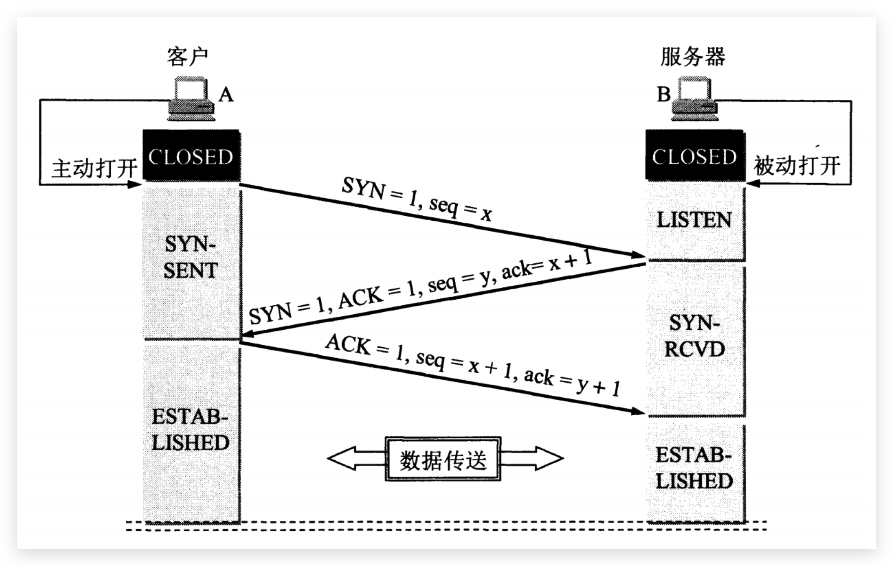
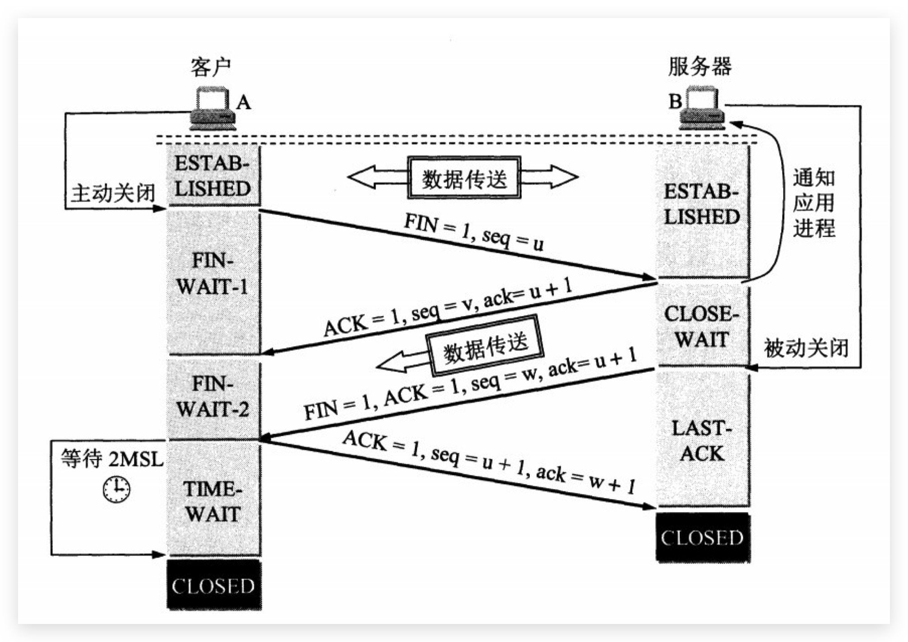
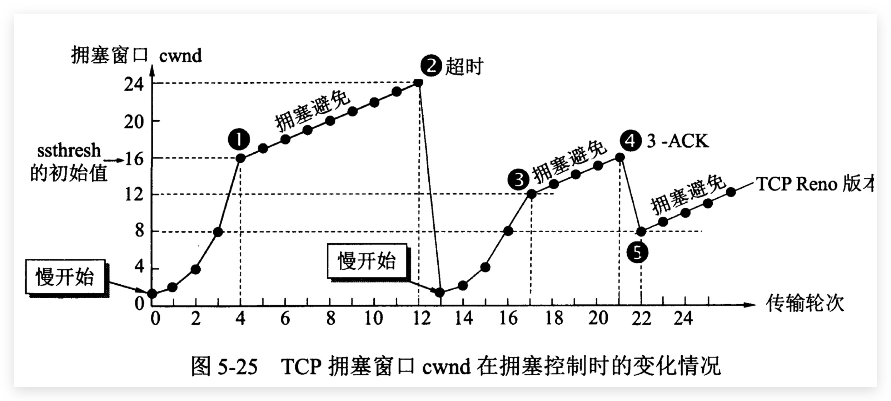
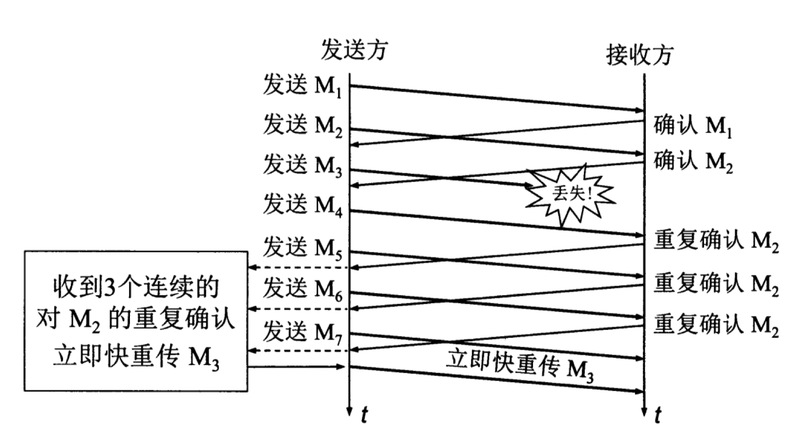
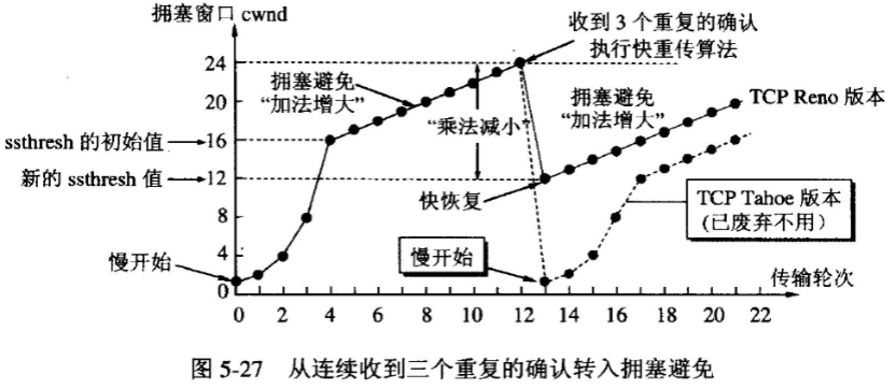

## TCP三次握手四次挥手&可靠性传输原理

### 1. 常用端口号

| 应用层协议 | 端口号 | 传输层协议                          |
| ---------- | ------ | ----------------------------------- |
| FTP        | 20,21  | TCP（数据连接20；控制连接21）       |
| TFTP       | 69     | UDP                                 |
| TELENT     | 23     | TCP                                 |
| SMTP       | 25     | TCP                                 |
| DNS        | 53     | UDP/TCP（长度超过512字节时使用TCP） |
| HTTP       | 80     | TCP                                 |
| HTTPS      | 443    | TCP                                 |
| SSH        | 22     | TCP                                 |
| MySQL      | 3306   | TCP                                 |

### 2.TCP概述

TCP把连接作为最基本的对象，每一条TCP连接都有两个端点，这种断点我们叫作套接字（socket），它的定义为端口号拼接到IP地址即构成了套接字，例如，若IP地址为192.3.4.16 而端口号为80，那么得到的套接字为192.3.4.16:80。

### 3.TCP报文首部

1. 源端口和目的端口，各占2个字节，分别写入源端口和目的端口；

2. 序号，占4个字节，**TCP连接中传送的字节流中的每个字节都按顺序编号**。例如，一段报文的序号字段值是301，而携带的数据共有100字段，显然下一个报文段（如果还有的话）的数据序号应该从401开始；

3. 确认号，占4个字节，是期望收到对方下一个报文的第一个数据字节的序号。例如，B收到了A发送过来的报文，其序列号字段是501，而数据长度是200字节，这表明B正确的收到了A发送的到序号700为止的数据。因此，B期望收到A的下一个数据序号是701，于是B在发送给A的确认报文段中把确认号置为701；

4. 数据偏移，占4位，它指出TCP报文的数据距离TCP报文段的起始处有多远；

5. 保留，占6位，保留今后使用，但目前应都位0；

6. 紧急URG，当URG=1，表明紧急指针字段有效。告诉系统此报文段中有紧急数据；

7. 确认ACK，**仅当ACK=1时，确认号字段才有效**。TCP规定，在连接建立后所有报文的传输都必须把ACK置1；

8. 推送PSH，当两个应用进程进行交互式通信时，有时在一端的应用进程希望在键入一个命令后立即就能收到对方的响应，这时候就将PSH=1；

9. 复位RST，当RST=1，表明TCP连接中出现严重差错，必须释放连接，然后再重新建立连接；

10. 同步SYN，在连接建立时用来同步序号。**当SYN=1，ACK=0，表明是连接请求报文，若同意连接，则响应报文中应该使SYN=1，ACK=1**；

11. 终止FIN，用来释放连接。当FIN=1，表明此报文的发送方的数据已经发送完毕，并且要求释放；

12. 窗口，占2字节，指的是通知接收方，发送本报文你需要有多大的空间来接受；

13. 检验和，占2字节，校验首部和数据这两部分；

14. 紧急指针，占2字节，指出本报文段中的紧急数据的字节数；

15. 选项，长度可变，定义一些其他的可选的参数。

### 4.TCP三次握手

最开始的时候客户端和服务器都是处于CLOSED状态。主动打开连接的为客户端，被动打开连接的是服务器。

1. TCP服务器进程先创建传输控制块TCB，时刻准备接受客户进程的连接请求，此时服务器就进入了LISTEN（监听）状态；

2. TCP客户进程也是先创建传输控制块TCB，然后向服务器发出连接请求报文，这时报文首部中的确认位ACK=0，同步位SYN=1，同时选择一个初始序列号 seq=x ，此时，TCP客户端进程进入了 SYN-SENT（同步已发送状态）状态。**TCP规定，SYN报文段（SYN=1的报文段）不能携带数据，但需要消耗掉一个序号**。

3. TCP服务器收到请求报文后，如果同意连接，则发出确认报文。确认报文中应该 ACK=1，SYN=1，确认号是ack=x+1，同时也要为自己初始化一个序列号 seq=y，此时，TCP服务器进程进入了SYN-RCVD（同步收到）状态。这个报文也不能携带数据，但是同样要消耗一个序号。

4. TCP客户进程收到确认后，还要向服务器给出确认。确认报文的ACK=1，ack=y+1，自己的序列号seq=x+1，此时，TCP连接建立，客户端进入ESTABLISHED（已建立连接）状态。TCP规定，ACK报文段可以携带数据，但是如果不携带数据则不消耗序号。

当服务器收到客户端的确认后也进入ESTABLISHED状态，此后双方就可以开始通信了。

#### 握手时产生的随机序列号干什么用的

如果不用序列号的话，Client在最后一步的发送中可以发送任意数据给Server，确认最后的连接过程且最终建立连接。由于Client可以随意伪造任意多的IP，那么最终Server建立了很多不存在且无用的TCP连接。

采用随机产生的初始化序列号进行请求，这样做主要是出于网络安全的因素着想。如果不是随机产生初始序列号，黑客将会以很容易的方式获取到你与其他主机之间通信的初始化序列号，并且伪造序列号进行攻击，这已经成为一种很常见的网络攻击手段。

#### 为什么TCP客户端最后还要发送一次确认？

**主要防止已经失效的连接请求报文突然又传送到了服务器，从而产生错误。**

如果使用的是两次握手建立连接，假设有这样一种场景，客户端发送了第一个请求连接并且没有丢失，只是因为在网络结点中滞留的时间太长了，由于TCP的客户端迟迟没有收到确认报文，以为服务器没有收到，此时重新向服务器发送这条报文，此后客户端和服务器经过两次握手完成连接，传输数据，然后关闭连接。此时此前滞留的那一次请求连接，网络通畅了到达了服务器，这个报文本该是失效的，但是，两次握手的机制将会让客户端和服务器再次建立连接，这将导致不必要的错误和资源的浪费。

如果采用的是三次握手，就算是那一次失效的报文传送过来了，服务端接受到了那条失效报文并且回复了确认报文，但是客户端不会再次发出确认。由于服务器收不到确认，就知道客户端并没有请求连接。

#### 如果目标的IP不存在或者端口不存在会怎么样

Client伪造大量随机IP，向Server发送ACK=0，SYN=1，seq=X的第一步的连接请求，Server给不存在的IP发送SYN=1，ACK=1，ack=X+1，seq=y响应，由于Client的IP实际不存在的，所以Server发出的消息不能到达，Server不断的重试直到超时，那么Server的连接队列会被占满，正常的TCP握手请求就无法到达Server，影响了正常的连接请求，导致网络阻塞或者Server系统瘫痪。

### 5.TCP四次挥手

数据传输完毕后，双方都可释放连接。最开始的时候，客户端和服务器都是处于ESTABLISHED状态，然后客户端主动关闭，服务器被动关闭。

1. 客户端进程发出连接释放报文，并且停止发送数据。释放数据报文首部，FIN=1，其序列号为seq=u（等于前面已经传送过来的数据的最后一个字节的序号加1），此时，客户端进入FIN-WAIT-1（终止等待1）状态。 TCP规定，FIN报文段即使不携带数据，也要消耗一个序号。

2. 服务器收到连接释放报文，发出确认报文，ACK=1，ack=u+1，并且带上自己的序列号seq=v，此时，服务端就进入了CLOSE-WAIT（关闭等待）状态。TCP服务器通知高层的应用进程，客户端向服务器的方向就释放了，这时候处于半关闭状态，即客户端已经没有数据要发送了，但是服务器若发送数据，客户端依然要接受。这个状态还要持续一段时间，也就是整个CLOSE-WAIT状态持续的时间。

3. 客户端收到服务器的确认请求后，此时，客户端就进入FIN-WAIT-2（终止等待2）状态，等待服务器发送连接释放报文（在这之前还需要接受服务器发送的最后的数据）。

4. 服务器将最后的数据发送完毕后，就向客户端发送连接释放报文，FIN=1，ack=u+1，由于在半关闭状态，服务器很可能又发送了一些数据，假定此时的序列号为seq=w，此时，服务器就进入了LAST-ACK（最后确认）状态，等待客户端的确认。

5. 客户端收到服务器的连接释放报文后，必须发出确认，ACK=1，ack=w+1，而自己的序列号是seq=u+1，此时，客户端就进入了TIME-WAIT（时间等待）状态。注意此时TCP连接还没有释放，必须经过2∗MSL（最长报文段寿命）的时间后，当客户端撤销相应的TCB后，才进入CLOSED状态。

6. 服务器只要收到了客户端发出的确认，立即进入CLOSED状态。同样，撤销TCB后，就结束了这次的TCP连接。可以看到，**服务器结束TCP连接的时间要比客户端早一些**。

#### 为什么客户端最后还要等待2MSL？

MSL（Maximum Segment Lifetime），TCP允许不同的实现可以设置不同的MSL值。

1. 保证客户端发送的最后一个ACK报文能够到达服务器，因为这个ACK报文可能丢失，站在服务端的角度看来，服务端已经发送了FIN+ACK报文请求断开了，客户端还没有给我回应，应该是我发送的请求断开报文它没有收到，于是服务器又会重新发送一次，而客户端就能在这个2MSL时间段内收到这个重传的报文，接着给出回应报文，并且会重启2MSL计时器。

2. 防止类似与“三次握手”中提到了的“已经失效的连接请求报文段”出现在本连接中。客户端发送完最后一个确认报文后，在这个2MSL时间中，就可以使本连接持续的时间内所产生的所有报文段都从网络中消失。这样新的连接中不会出现旧连接的请求报文。

#### 为什么建立连接是三次握手，关闭连接确是四次挥手呢？

建立连接的时候，服务器在LISTEN状态下，收到建立连接请求的SYN报文后，把ACK和SYN放在一个报文里发送给客户端。

而关闭连接时，服务器收到对方的FIN报文时，仅仅表示对方不再发送数据了但是还能接收数据，而自己也未必全部数据都发送给对方了，所以己方可以立即关闭，也可以发送一些数据给对方后，再发送FIN报文给对方来表示同意现在关闭连接，因此，己方ACK和FIN一般都会分开发送，从而导致多了一次。

#### 如果已经建立了连接，但是客户端突然出现故障了怎么办？

TCP设有一个保活计时器，显然，客户端如果出现故障，服务器不能一直等下去，白白浪费资源。服务器每收到一次客户端的请求后都会重新复位这个计时器，时间通常是设置为2小时，若两小时还没有收到客户端的任何数据，服务器就会发送一个探测报文段，以后每隔75秒发送一次。若一连发送10个探测报文仍然没反应，服务器就认为客户端出了故障，接着就关闭连接。

### 6.TCP可靠性传输原理

1. 发送方每次发送一个报文段后，接收方必须要回复给发送方已经收到的确认信息。

2. **校验和：** TCP 将保持它首部和数据的检验和。这是一个端到端的检验和，目的是检测数据在传输过程中的任何变化。如果收到段的检验和有差错，TCP 将丢弃这个报文段和不确认收到此报文段。

3. 出现差错的时候，如果发送方发送了一个报文后，在一段时间内还没收到确认返回，这时候就要重新发送刚才报文，称为超时重传。（发送方的角度）

4. 在接收方，并不知道报文的丢失，在发送方重发的报文过来后，接收以后，突然之前在网络中丢失的那段报文突然到达了，原来是因为网络延迟的缘故，这时候**接收方应该立即丢弃这个报文，但是还需要向发送方发送确认，只不过这时候发送方接收到这个如果是重复的确认不做任何的处理**。

5. 连续的ARQ协议保障可观的信道利用率。如果每次我们发送一个报文，等待第一个报文的确认再发送第二个报文，这样的话好是好，但是信道的利用率太低，所以采用持续的发送窗口，位于发送窗口中的报文可以连续发送出去，每次收到一个分组的确认，窗口向前滑动一个分组。

### 7.TCP可靠性传输的实现

#### 滑动窗口机制

TCP的滑动窗口是以字节为单位的。发送方为A，维护发送窗口，接收方为B，维护接收窗口。发送窗口A的状态需要三个指针来描述，P1，P2，P3，小于P1的是已经发送并已经收到确认的部分，而大于P3部分的是不允许发送的部分。P3-P1=A，即发送窗口或者通知窗口。P2-P1=已经发送的但是尚未收到确认的字节数。P3-P2=允许发送但是尚未发送的字节数。

- 如果B接受某序列的顺序为a,b,c, 但是由于某种原因a没有收到，b,c收到了，但是此时B发送的确认报文段中的确认号任然是a的而不是其它的，而b,c就缓存在B中的接收窗口中。

- 如果A在继续发送数据的时候P2和P3重合了，意味着发送窗口已满，还没收到一个确认号，可用窗口减少到0，所以必须立即停止发送。当然如果这时候A窗口中的所有报文都发送出去了，而且B已经接受到了，但是确认报文却在网络传输中丢失了，过了一段时间后，那么A只能认为B没有收到（由超时计时器控制）重传这部分数据。

- 接受窗口接收按序到达的但是还没有被应用程序接收的数据以及未按序到达的。如果接受程序来不及读取收到的数据，接收缓存最终就会被填满，接收窗口就减小到0。这时候接收方就不能接收报文了。

- 虽然A的发送窗口是根据B的接收窗口设置的，但是在同一时刻A的发送窗口并不总是和B的接收窗口一样大。因为网络有一些滞后，或者A还要根据自己的情况调整数值。

#### TCP的流量控制

流量控制的意思就是发送方的发送速率不要太快，要让接收方来得及接收。

- 总的来说就是发送方的发送窗口不能超过接收方给出的接收窗口的的数值。接收方在发送确认ACK的时候附带这样一个参数。

- 如果接收方的由于某种原因（a,报文没有按序到达，缓存后面的报文;b,接收方来不及处理这么多报文）使得接收窗口一直减少到0，即不允许发送方再发送数据了。直到主机B重现新发送一个不为0的新窗口过来为止。

- 为了防止这种情况，当B的接收窗口为0后，在某一时刻，缓存释放了又有了一些新空间，于是发送一个报文通知A有空间了，可以开始传输数据了。然而这个报文在传输的过程中丢失了，但是A并不知道，一直在等待，从而造成一种相互等待的死锁。**TCP为每个连接设置了一个持续计数器，只要TCP接收到一个对方窗口为0的通知，就启动持续计时器。每隔一段时间去发送一个0窗口的探测报文，获取对方的窗口值是否为0。**

#### TCP的拥塞控制

若网络中的某一资源的需求已经超过了该资源所能提供的有效的部分 ，网络的性能就开始下降了，就称发生拥塞了。

##### 流量控制和拥塞控制的区别

拥塞控制是防止过多的数据注入到网络，使得网络中的路由器或者链路过载。它是一个全局性的过程，涉及到所有的主机和路由器以及与降低网络传输性能有关的所有因素。

相反，流量控制往往是指的点对点的通信量的控制，是个端到端的问题。流量控制所要做的就是抑制发送方发送的速率，以便接收方来得及接收。流量控制根本目的是防止分组丢失，它是构成TCP可靠性的一方面。

- 轻度拥塞：当网络的吞吐量明显小于理想的吞吐量。

- 拥塞状态：网络的吞吐量反而随提供的负载的增大而下降。

- 死锁：负载继续增大，网络的吞吐量下降到零，网络已经无法工作。

##### 拥塞控制的手段

- **慢开始**

发送方维持一个叫做拥塞窗口(cwnd)的状态变量，它的大小取决于网络额拥塞程度，动态变化。当主机开始发送数据的时候，不是立即把大量的数据注入到网络，而是采用从小到大的方式探测，将拥塞窗口从小到大进行增加。通常在最开始的时候，将拥塞窗口的大小设置为1。然后每次收到接收方的一个确认报文，将窗口的大小扩充2倍，因此每经过一个传输轮次，拥塞窗口就加倍: cwnd = 1,2,4,8...

- **拥塞避免**

由于慢开始的策略，拥塞窗口一直增加，为了防止拥塞窗口增长过大引起网络拥塞，还需要设置一个慢开始门限(ssthresh)。

拥塞窗口 < 慢开始门限，使用慢开始算法。

拥塞窗口 > 慢开始门限，停止使用慢开始算法，改用拥塞避免算法。

拥塞窗口 = 慢开始门限，既可以使用慢开始算法，也可以使用拥塞避免算法。

拥塞避免算法的目的是让拥塞窗口缓慢增大，每次收到一个确认以后，不是像慢开始一样，将拥塞窗口加倍，而是 **拥塞窗口大小加1**。这样拥塞窗口就按照线性缓慢增长。

无论在慢开始阶段还是拥塞避免阶段，只要发送方判断网络出现拥塞（根据是没有按时收到确认），就令ssthresh = cwnd / 2，然后把拥塞窗口cwnd设置为1，重新执行慢开始算法。

- **快重传和快恢复**

当不使用快重传机制，发送方设置的超时计时器时限已到，但是还没有收到确认，那么很可能发送方的报文在网络中已经被丢弃了，这时候发送方就认为已经发生网络拥塞了，将慢开始门限减半，拥塞窗口置为1，执行慢开始算法。

快重传算法是要求，每收到一个失序的报文段后就立即发出重复确认（目的是让发送方及早知道报文段有没有达到对方）而不是等待自己发送数据时才进行捎带确认。

如果有四个个报文abcdef，ab已经收到，分别发送了确认报文A，B，但是，c报文的发送丢失了，这时候在接收到d，e，f 的报文后，显然不能进行确认，应及时发送对b的确认，也就是说，发送方一共会收到b报文的四次确认，其中有三次是重复的。

快重传算法规定，一旦发送方一连收到三个重复的确认，就立即重传对方没有收到的报文c，不必等到c的超时计时器到期再重传。

与快重传配合使用的还有快恢复,当发送方一连收到三个重复确认，就把慢开始的门限减半ssthresh = cwnd / 2，cwnd=ssthresh，但是不执行慢开始算法，依然执行拥塞避免算法（因为发送方是通过超时来判断网络是否拥塞，才会将慢开始门限减半，执行慢开始算法）。

在采用快恢复算法时，慢开始算法只是在TCP连接建立时和网络出现超时时才使用。 

- **随机早期检测 RED**

前面讨论的TCP的拥塞控制都没有和网络层联系起来。路由器的队列通常都是按照先进先出的规则来处理分组的。由于队列的长度总是有限，所以当队列已满时，以后到达的分组都将被丢弃。

但是这种尾部丢弃策略有时候会是的拥塞控制恰得其反，如果某一时间段导致一连串的分组都丢失，这时候就会使得发送方超时重发，TCP进入慢开始阶段，使得发送方突然把发送速率降到最低。更为严重的是，网络中的很多TCP连接通常是复用在IP数据报中。这种情况下，若发生尾部丢弃，就可能影响多条TCP连接，结果使得很多TCP连接在同一时刻都进入到慢开始阶段，使得网络通讯量迅速降低很多，而在网络恢复的时候，其通讯量又突然增大很多。为了避免这种情况，可以在路由器中采用随机早期检测措施

路由器的队列维持两个参数，队列长度最小门限和最大门限。经验值证明，最大门限等于最小门限的值的两倍是合适的。当每一个分组到达时，RED组都要计算平均队列长度。

若平均队列长度 < 最小门限，则把新到达的分组放入队列中。

若平均队列长度 > 最大门限，则把新到达的分组全部丢弃。

若平均队列长度在最小门限和最大门限之间，则按照一定的概率将新到达的分组进行丢弃。

#### 拥塞控制和流量控制的差别

流量控制只涉及到点到点的通信，而拥塞控制则包含整个通信网络（整体和个体）。

- 流量控制往往指的是点对点通信量的控制，是个端到端的问题。流量控制所要做的就是控制发送端发送数据的速率，以便使接收端来得及接受。

- 拥塞控制就是防止过多的数据注入到网络中，这样可以使网络中的路由器或链路不致过载。拥塞控制所要做的都有一个前提，就是网络能承受现有的网络负荷。拥塞问题是一个全局性的问题,涉及到所有的主机、所有的路由器、以及与降低网络传输性能有关的所有因素。

### 8.异常处理

#### （1）服务器主机崩溃

  客户端在给服务器发送数据时，由于收不到服务器端回传的ACK确认报文，正常情况下，客户端TCP均会进行超时重传，一般为重传12次大约9分钟后才放弃重传，并关闭客户端TCP链接。

#### （2）服务器主机崩溃后重启

  如果服务器主机在崩溃重启的这段时间里，客户端没有向服务器发送数据，即客户端没有因重传次数超过限制关闭TCP链接。则在服务器重启后，当客户端再向服务器发送TCP报文时，由于服务器中的TCP链接已经关闭，会直接向客户端回复RST报文，客户端在接收RST报文后关闭自己的TCP链接。

#### （3）服务器主机断网或者中间路由器出现故障

  与情况1类似，客户端会进行超时重传，直到重传次数超过后放弃重传，并关闭客户端TCP链接。(因为TCP中会忽略目的主机不可达和目的网络不可达的ICMP报文，并进行重传，直到重传总时间超过限制)

#### （4）服务器主机断网或者中间路由器出现故障后又恢复

  如果在服务器主机断网或者中间路由器出现故障这段时间内，客户端和服务器之间没有进行相互通信，即双方均没有察觉对方目的不可达，则在恢复网络链接后两端的TCP链接均有效，能够正常继续进行通信。

  如果在服务器主机断网或者中间路由器出现故障这段时间内，客户端因向服务器发送数据超时，并重传总时间超过限制关闭TCP链接。则再网络恢复后，服务器再向客户端发送TCP报文时，客户端也会直接恢复RST报文，服务器再收到RST报文后关闭自己的TCP链接。

#### （5）服务器关机或服务器进程被终止

  正常情况下服务器主机被关机时，操作系统都会事先通知所有仍在运行的进程，并先将所有进程终止后，再继续关闭电脑。而所有的进程在被终止时，Unix操作系统内核都会事先去关闭所有已经打开的TCP链接，即向客户端发生FIN标志报文，进行四次握手关闭连接。

  因此，对于这种情况，客户端是能够察觉到并正常关闭TCP链接。

#### （6）服务器的端口被关闭

  如果在通信过程中，服务器的监听端口被管理员或系统禁掉，则当客户端再向服务器发送TCP报文时，服务器在收到该报文后，由于发送该目的端口没有处于监听状态，则会直接向客户端发送RST报文，客户端在收到RST报文后会直接关闭自己TCP链接。

### 9.TCP的保活机制

**TCP中的保活机制是一个可选项，并不是必须的。**

主要用在服务器端，用于检测已建立TCP链接的客户端的状态，防止因客户端崩溃或者客户端网络不可达，而服务器端一直保持该TCP链接，占用服务器端的大量资源(因为Linux系统中可以创建的总TCP链接数是有限制的)。

保活机制原理：设置TCP保活机制的保活时间keepIdle，即在TCP链接超过该时间没有任何数据交互时，发送保活探测报文；设置保活探测报文的发送时间间隔keepInterval；设置保活探测报文的总发送次数keepCount。如果在keepCount次的保活探测报文均没有收到客户端的回应，则服务器端即关闭与客户端的TCP链接。

