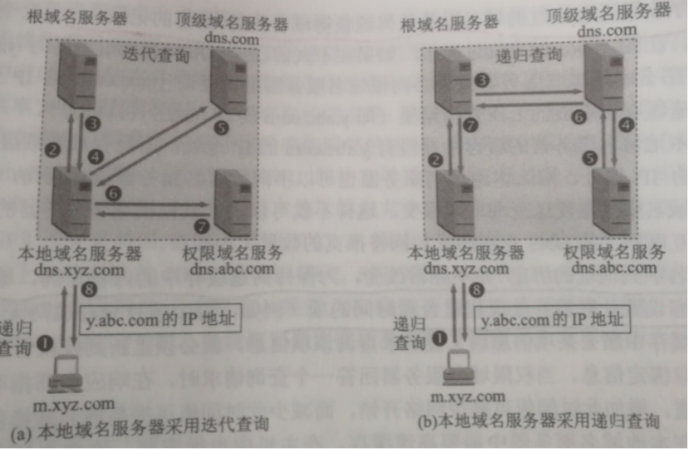
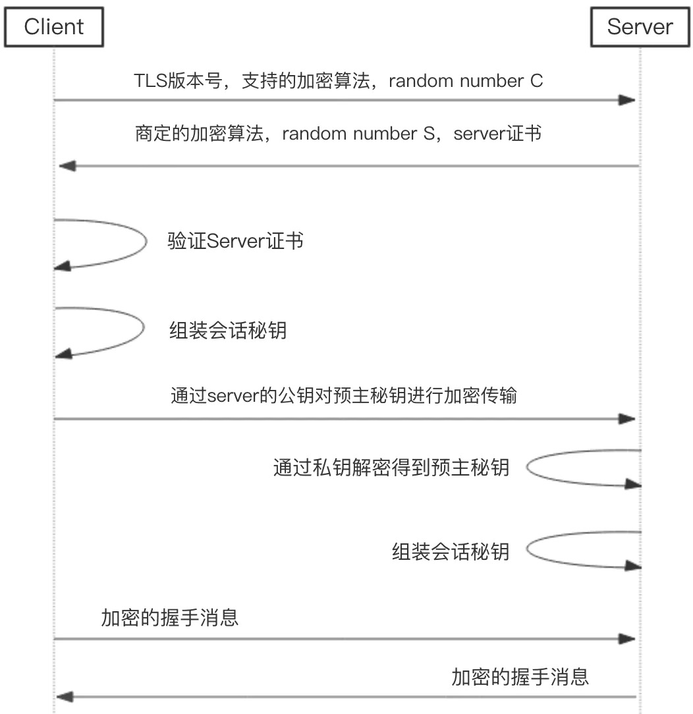
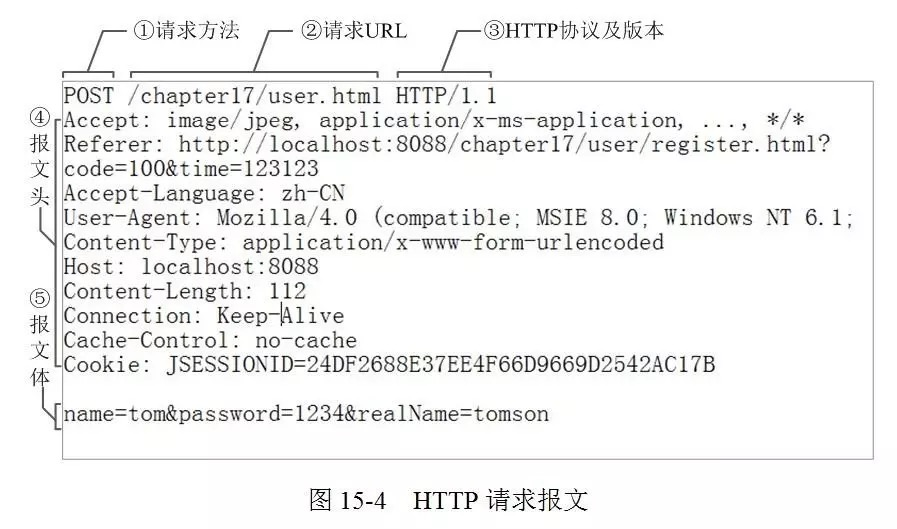

## 计算机网络基础


### 1.TCP和UDP的区别

UDP协议和TCP协议都是传输层协议。

| TCP                              | UDP                                             |
| -------------------------------- | ----------------------------------------------- |
| 面向连接、传输可靠，速度慢       | 无连接、传输不可靠、速度快                      |
| TCP首部开销20字节                | UDP的首部开销小，只有8个字节                    |
| 应用于少量数据传输               | 应用于大量数据传输                              |
| 可靠的字节流服务                 | 面向报文的                                      |
| TCP连接只能是点到点的            | UDP支持一对一，一对多，多对一和多对多的交互通信 |
| 有确认、窗口、重传、拥塞控制机制 | 无                                              |

### 2. TCP和UDP的使用场景

TCP协议适用于对效率要求相对低，但对准确性要求相对高的场景下，或者是有一种连接概念的场景下；而UDP协议适用于对效率要求相对高，对准确性要求相对低的场景。

TCP一般用于文件传输（FTP HTTP 对数据准确性要求高，速度可以相对慢），发送或接收邮件（POP IMAP SMTP 对数据准确性要求高，非紧急应用），远程登录（TELNET SSH 对数据准确性有一定要求，有连接的概念）等等。

UDP一般用于即时通信（QQ聊天，对数据准确性和丢包要求比较低，但速度必须快），在线视频（RTSP 速度一定要快，保证视频连续，但是偶尔花了一个图像帧，人们还是能接受的），网络语音电话（VoIP 语音数据包一般比较小，需要高速发送，偶尔断音或串音也没有问题）等等。

### 3. GET和POST的区别

|                  | GET                           | POST                      |
| ---------------- | ----------------------------- | ------------------------- |
| 后退按钮/刷新    | 无害                          | 数据会被重新提交          |
| 书签             | 可收藏为书签                  | 不可收藏为书签            |
| 缓存             | 能被缓存                      | 不能缓存                  |
| 请求参数保留与否 | 被完整保留在浏览器历史记录里  | 不会被保留                |
| 数据长度的限制   | URL的长度是受限制的2048       | 无限制                    |
| 数据类型限制     | 只允许ASCII字符               | 没有限制,也允许二进制数据 |
| 安全性           | 安全性较差                    | 安全性较高                |
| 效率             | 效率高                        | 效率低                    |
| 可见性           | 数据在URL中对所有人都是可见的 | 数据不会显示在URL中       |

### 4. 除了GET POST那些还有什么

| 方法    | 描述                                                         |
| ------- | ------------------------------------------------------------ |
| GET     | 主要用于向指定的URL（URI）请求资源（资源文件或是数据均可）   |
| POST    | 主要是向指定的URL（URI）提交数据, 通常用于表单发送           |
| HEAD    | HEAD方法和GET方法一样，只是不返回报文的主体部分;GET方法有实体，HEAD方法无实体 |
| PUT     | 更新                                                         |
| DELETE  | 删除                                                         |
| OPTIONS | 允许客户端查看服务器的性能                                   |
| TRACE   | 对请求消息的传输路径进行追踪                                 |
| CONNECT | HTTP/1.1协议中预留给能够将连接改为管道方式的代理服务器       |

### 5. DNS域名解析域名系统



**域名的解析过程**

假设域名为m.xyz.com的主机想知道另一台主机（y.abc.com）的ip地址

1. 主机m.xyz.com向本地域名服务器dns.xyz.com进行递归查询

2. 本地域名服务器采用迭代查询，它先向一个根域名服务器查询

3. 根域名服务器告诉本地域名服务器，下一次查询的顶级域名服务器dns.com的ip地址

4. 本地域名服务器向顶级域名服务器dns.com进行查询

5. 顶级域名服务器dns.com告诉本地域名服务器，下一次要查询的权限域名服务器dns.abc.com的ip地址

6. 本地域名服务器向权限域名服务器dns.abc.com进行查询

7. 权限域名服务器dns.abc.com告诉本地域名服务器，所查询的主机ip地址

8. 本地域名服务器最后把查询结果告诉主机m.yxyz.com

这八个步骤需要8个UDP用户数据报的报文

#### DNS 解析流程

- **浏览器缓存**

通过浏览器访问某域名时，浏览器首先会在自己的缓存中查找是否有该域名对应的 IP 地址（若曾经访问过该域名且没有清空缓存便会存在）

- **系统缓存**

当浏览器缓存中无域名对应 IP 则会自动检查用户计算机系统 hosts 文件中是否有该域名对应的 IP

- **路由器缓存**

当浏览器及系统缓存中均无域名对应 IP 则进入路由器缓存中检查，以上均是用于本地机器的 DNS 缓存

- **ISP（互联网服务提供商）DNS 缓存**

当在本地机器查询不到域名对应 IP 地址时，则将进入 ISP DNS 缓存中进行查询。比如你用的是电信的网络，则会进入电信的 DNS 缓存服务器中进行查找；也可以通过修改本机的 DNS 配置来绕过 ISP 的 DNS 缓存

- **根域名服务器**

当以上均未完成查询，则进入根服务器进行查询。根域名收到请求后会查看区域文件记录，若无则将其管辖范围内顶级域名（如.com）服务器 IP 告诉 Local DNS 服务器，Local DNS 服务器再向顶级域名服务器其查询

- **顶级域名服务器**

顶级域名服务器收到请求后查看区域文件记录，若无则将其管辖范围内主域名服务器的 IP 地址告诉 Local DNS 服务器，以继续后续的查询

- **主域名服务器**

主域名服务器接受到请求后查询自己的缓存，如果没有则进入下一级域名服务器进行查找，并重复该步骤直至找到正确纪录

- **保存结果至缓存**

本地域名服务器把返回的结果保存到缓存，以备下一次使用，同时将该结果返回，于是并可通过这个 IP 地址与 web 服务器建立通信连接

#### 如何减少DNS的传输时间

在域名服务中广泛使用高速缓存（高速缓存域名服务器）。用来存放最近查询过的域名以及何处获得域名映射信息的记录。由于名字到地址的绑定并不经常改变，为保证高速缓存中的内容正确，域名服务器应当为每项内容设置计时器并处理超过合理时间的项。

减少域名DNS解析的时间的方法：

（1）DNS缓存：合理利用DNS TTL值增加域名的缓存命中率

（2）DNS预读取：默认情况下浏览器会有隐式的DNS Prefetch

（3）拆分域名：DNS域名解析拆分为多个域名增加并行下载量

### 6. HTTP协议

HTTP是应用层协议。

特点：

- 简单快速：简单的填写请求路径和请求方法即可

- 灵活：传输任意类型任意格式的数据对象

- 无连接：限制每次连接只处理一个请求

- 无状态：客户端发送HTTP请求后，服务器根据请求，会给我们发送数据，发送完后，不会记录信息。

HTTP使用统一资源标识符（URI）来传输数据和建立连接：http://www.aspxfans.com:8080/news/index.asp?boardID=5&amp;ID=24618#name 

协议、域名、端口、虚拟目录、文件名、参数、锚点

#### HTTP可以使用UDP吗

HTTP是基于TCP的。HTTP是传输协议，假如使用UDP，要解决很多问题比如丢包，流控，拥塞，重包检测，用UDP实现这些的话，相当于重新写了一次TCP协议。实际上确实有UDP实现的HTTP，叫HTTPU。

### 7. HTTPS协议及其作用

HTTPS=HTTP+SSL（TLS）。原本HTTP先和TCP（假定传输层是TCP协议）直接通信，而加了SSL后，就变成HTTP先和SSL通信，再由SSL和TCP通信，相当于SSL被嵌在了HTTP和TCP之间。HTTP协议由于是明文传送，所以存在三大风险：窃听、篡改、冒充。

HTTP因为存在以上三大安全风险，所以才有了HTTPS的出现。

#### HTTPS建立连接的过程、SSL握手



1. **客户端访问HTTPS连接**

客户端会把安全协议版本号、客户端支持的加密算法列表、随机数C发给服务端

2. **服务端发送证书给客户端**

服务端接收密钥算法配件后，会和自己支持的加密算法列表进行比对，如果不符合，则断开连接;

否则，服务端会在该算法列表中，选择一种 **对称算法**（如AES）、一种公钥算法（如具有特定秘钥长度的RSA）和一种MAC算法发给客户端。

服务器端有一个密钥对，即公钥和私钥，是用来进行非对称加密使用的，服务器端保存着私钥，不能将其泄露，公钥可以发送给任何人;

在发送加密算法的同时还会把数字证书和随机数S发送给客户端

3. **客户端验证server证书**

会对server公钥进行检查，验证其合法性，如果发现发现公钥有问题，那么HTTPS传输就无法继续

4. **客户端组装会话秘钥**

如果公钥合格，那么客户端会用服务器公钥来生成一个前主秘钥(Pre-Master Secret，PMS)，并通过该前主秘钥和随机数C、S来组装成会话秘钥

5. **客户端将前主秘钥加密发送给服务端**

通过服务端的公钥来对前主秘钥进行非对称加密，发送给服务端

6. **服务端通过私钥解密得到前主秘钥**

服务端接收到加密信息后，用私钥解密得到主秘钥

7. **服务端组装会话秘钥**

服务端通过前主秘钥和随机数C、S来组装会话秘钥。

至此，服务端和客户端都已经知道了用于此次会话的主秘钥。

8. **数据传输**

客户端收到服务器发送来的密文，用客户端密钥对其进行对称解密，得到服务器发送的数据。

同理，服务端收到客户端发送来的密文，用服务端密钥对其进行对称解密，得到客户端发送的数据。

为什么传输的时候要用对称加密：因为非对称加密解密算法效率较低，不适合客户端和服务器端这样高频率的通信过程，在某些极端情况下，甚至能比非对称加密慢上1000倍。

#### HTTPS怎么确认收到的包就是服务器发来的

HTTPS对端口和IP不加密，建立通信之后，后续的包就知道是服务器发来的了

### 8. 浏览器中输入网址到获得页面的全过程

1. URL中获取域名: URL由通信协议+域名+端口号+资源路径组成，浏览器需要从URL中解析要请求的域名

2. 域名解析成IP地址: 浏览器缓存 -> hosts缓存 -> 路由器缓存。否则请求域名解析服务器：主机 -> 本地域名服务器 -> 根域名服务器 -> 顶级域名服务器 -> 权限域名服务器 -> 本地域名服务器 -> 主机

3. 与目的主机进行TCP连接（三次握手）

4. 浏览器发出读取文件(URL 中域名后面部分对应的文件)的HTTP请求，在建立起的TCP连接中，按照HTTP协议标准发送一个索要网页的请求

5. 服务器对浏览器请求作出响应，并把对应的HTML文本发送给浏览器

6. 释放TCP连接

7. 浏览器将该HTML文本载入并显示内容

### 9. 输入 www.baidu.com，怎么变成https://www.baidu.com 的，怎么确定用HTTP还是HTTPS

一种是原始的302跳转（重定向），服务器把所有的HTTP流量跳转到HTTPS。但这样有一个漏洞，就是第一次访问站点的时候如果是 HTTP 就有可能被中间人劫持，很可能都没到302跳转的时候就被劫持了。解决方法是引入HSTS机制，用户浏览器在访问站点的时候强制使用HTTPS。 

如何实现：通过HTTPS协议访问你站点的时候，在响应头中加上这样一段信息：`Strict-Transport-Security "max-age=63072000; includeSubdomains;"`Strict-Transport-Security 是 Header 字段名， 后面的 max-age 代表 HSTS 在客户端的生效时间; includeSubdomains 表示对所有子域名生效

### 10. HTTP跨域问题和HTTP版本

浏览器存在同源策略，当域名、端口、协议中任何一个不相同，浏览器就认为是跨域。

- HTTP1.0：当前浏览器客户端与服务器端建立连接之后，只能发送一次请求，一次请求之后连接关闭。【短连接】HTTP1.0定义了三种请求方法： GET, POST 和 HEAD方法。

- HTTP1.1：当前浏览器客户端与服务器端建立连接之后，可以在一次连接中发送多次请求。【长连接】HTTP1.1新增了五种请求方法：OPTIONS, PUT, DELETE, TRACE 和 CONNECT 方法。

### 11. 7层模型和5层模型，每一层有哪些常见协议？


1. **应用层**：域名系统DNS、万维网应用HTTP协议、支持电子邮件的SMTP协议、FTP

2. **传输层**：传输控制协议TCP、用户数据报协议UDP

3. **网络层**：ICMP、IGMP、地址解析协议ARP（IP地址和硬件地址映射）

#### 网络各层作用 

**物理层**：利用传输介质为数据链路层提供物理连接，实现比特流的透明传输。

**数据链路层**：负责建立和管理节点间的链路。

**网络层**：通过路由选择算法，为报文或分组通过通信子网选择最适当的路径。

**传输层**：向用户提供可靠的端到端的差错和流量控制，保证报文的正确传输。

**会话层**：向两个实体的表示层提供建立和使用连接的方法。

**表示层**：处理用户信息的表示问题，如编码、数据格式转换和加密解密等。

**应用层**：直接向用户提供服务，完成用户希望在网络上完成的各种工作。

### 12. ping

**ping是基于ICMP协议的**

IP协议是一种无连接的，不可靠的数据包协议，它并不能保证数据一定被送达，那么我们要保证数据送到就需要通过其它模块来协助实现，这里就引入的是ICMP协议。

当传送的IP数据包发送异常的时候，ICMP就会将异常信息封装在包内，然后回传给源主机。

假设有两个主机，主机A（192.168.0.1）和主机B（192.168.0.2），现在我们要监测主机A和主机B之间网络是否可达，那么我们在主机A上输入命令：`ping 192.168.0.2`

1. ping命令会在主机A上构建一个ICMP的请求数据包，然后ICMP协议会将这个数据包以及目标IP（192.168.0.2）等信息一同交给IP层协议。

2. IP层协议得到这些信息后，将源地址（即本机IP）、目标地址（即目标IP：192.168.0.2）、再加上一些其它的控制信息，构建成一个IP数据包。

3. IP数据包构建完成后，还不够，还需要加上MAC地址，因此，还需要通过ARP映射表找出目标IP所对应的MAC地址。当拿到了目标主机的MAC地址和本机MAC后，一并交给数据链路层，组装成一个数据帧，依据以太网的介质访问规则，将它们传送出出去。

4. 当主机B收到这个数据帧之后，会首先检查它的目标MAC地址是不是本机，如果是就接收下来处理，接收之后会检查这个数据帧，将数据帧中的IP数据包取出来，交给本机的IP层协议，然后IP层协议检查完之后，再将ICMP数据包取出来交给ICMP协议处理，当这一步也处理完成之后，就会构建一个ICMP应答数据包，回发给主机A。

在一定的时间内，如果主机A收到了应答包，则说明它与主机B之间网络可达，如果没有收到，则说明网络不可达。除了监测是否可达以外，还可以利用应答时间和发起时间之间的差值，计算出数据包的延迟耗时。

### 13. 经过路由器之后，什么改变了

A—–(B1-B2)—–(C1-C2)——-E

如上拓扑图为例，B1和B2是路由器B上的两个接口，C1和C2是路由器C上的两个接口，A和E是PC，由主机A向主机E发送数据包，那么**在主机A形成的数据包的目的IP就是E的IP，源IP就是主机A的IP地址，目标MAC地址就是B1的MAC地址，源MAC地址就是A的MAC地址**。

由A发给路由器B，B经过重封装后，源IP和目标IP是不变的，源MAC地址变成B2的MAC地址，目标MAC地址变成C1的MAC地址，封装完成发送给路由器C，路由器C接收到数据包后和B做的操作是一样的，源IP和目标IP的不变的，源MAC地址变成C2的MAC地址，目标MAC地址变成主机E的MAC地址，然后发送给主机E，这样E就收到了这个数据包，当恢复数据包的时候就是把收到的数据包的源IP地址（主机A的IP地址）和源MAC地址（接口C2的MAC地址）作为他的目标IP和目标MAC地址。

### 14. Traceroute

traceroute命令利用ICMP协议定位计算机和目标计算机之间的所有路由器。

检测主机到目的主机之间所经路由情况：`traceroute hostname`

Traceroute收到目的主机的IP后

1. 首先给目的主机发送一个TTL=1的UDP数据包，第一个路由器收到这个数据包以后，就自动把TTL减1，然后返回ICMP超时给主机。

2. 主机继续发出ICMP报文，设置TTL为2，第二个路由器给主机发ICMP数据报。返回ICMP超时给主机，并记录返回的路由地址。

一直重复这个过程，每次都将TTL在上一次的基础上加一，直到达到目的地。这样就可以记录所有经过的路由地址。

### 15. TCP粘包

#### 包的概念

- 数据帧（Frame）：是一种信息单位，它的起始点和目的点都是数据链路层。

- 数据包（Packet）：也是一种信息单位，它的起始和目的地是网络层。

- 数据报（Datagram）：通常是指起始点和目的地都使用无连接网络服务的的网络层的信息单元。

- 段（Segment）：通常是指起始点和目的地都是传输层的信息单元。

- 消息（message）：是指起始点和目的地都在网络层以上（经常在应用层）的信息单元。

- 元素（cell）是一种固定长度的信息，它的起始点和目的地都是数据链路层。

##### PDU：协议数据单元

- 数据链路层的PDU叫做Frame（帧）

- 网络层的PDU叫做Packet（数据包）

- TCP的PDU叫做Segment（数据段）

- UDP的PDU叫做Datagram

Packet（数据包）：封装的基本单元，它穿越网络层和数据链路层的分解面。通常一个Packet映射成一个Frame，但也有例外：即当数据链路层执行拆分或将几个Packet合成一个Frame的时候。

一个Datagram可能被封装成一个或几个Packets，在数据链路层中传输帧和数据包都是数据的传输形式。帧，工作在二层，数据链路层传输的是数据帧，包含数据包，并且增加相应MAC地址与二层信息；数据包，工作在三层，网络层传输的是数据包，包含数据报文，并且增加传输使用的IP地址等三层信息。

#### TCP粘包

应用程序首先要将自己的数据通过套接字发送。应用层交付给TCP的是结构化的数据，结构化的数据到了TCP层做流式传输。

TCP粘包是指发送方发送的若干包数据到接收方接收时粘成一包，从接收缓冲区看，后一包数据的头紧接着前一包数据的尾。

**接收方不知道该接收多大的数据才算接收完毕，造成粘包。**

##### 什么时候需要考虑粘包问题

1. 如果利用TCP每次发送数据，就与对方建立连接，然后双方发送完一段数据后，就关闭连接，这样就不会出现粘包。

2. 如果发送数据无结构，如文件传输，这样发送方只管发送，接收方只管接收存储就ok，也不用考虑粘包。

#### 粘包发生场景

##### 保护消息边界和流

保护消息边界，就是指传输协议把数据当作一条独立的消息在网上传输，接收端只能接收独立的消息。也就是说存在保护消息边界，接收端一次只能接收发送端发出的一个数据包。而面向流则是指无保护消息保护边界的，如果发送端连续发送数据，接收端有可能在一次接收动作中，会接收两个或者更多的数据包。

例如，我们连续发送三个数据包，大小分别是2k，4k ，8k,这三个数据包，都已经到达了接收端的网络堆栈中，如果使用UDP协议，不管我们使用多大的接收缓冲区去接收数据，我们必须有三次接收动作，才能够把所有的数据包接收完。而使用TCP协议，我们只要把接收的缓冲区大小设置在14k以上，我们就能够一次把所有的数据包接收下来，只需要有一次接收动作。

*粘包在流传输中出现，UDP不会出现粘包，因为它有消息边界。*

##### TCP连接复用造成粘包

如果没有复用，一个连接只提供给端到端的两个进程使用，这是数据的传输方和发送方都是约定好了数据的格式的，但是多个进程使用一个TCP连接，此时多种不同结构的数据进到TCP的流式传输，边界分割容易导致粘包。

##### 发送端需要等缓冲区满才发送出去，造成粘包

Nagle算法主要做两件事，1）只有上一个分组得到确认，才会发送下一个分组；2）收集多个小分组，在一个确认到来时一起发送。

发送方引起的粘包是由TCP协议的Nagle算法造成的，TCP为提高传输效率，发送方往往要收集到足够多的数据后才发送一包数据。若连续几次发送的数据都很少，通常TCP会根据优化算法把这些数据合成一包后一次发送出去，如果没有好的边界处理，这样接收方在解包时会出现粘包数据。

##### 接收方不及时接收缓冲区的包，造成多个包接收

由于接收方用户进程不及时接收数据，从而导致粘包现象。这是因为接收方先把收到的数据放在系统接收缓冲区，用户进程从该缓冲区取数据，若下一包数据到达时前一包数据尚未被用户进程取走，则下一包数据放到系统接收缓冲区时就接到前一包数据之后，而用户进程根据预先设定的缓冲区大小从系统接收缓冲区取数据，这样就一次取到了多包数据。

##### 数据包过大造成粘包问题

比如应用进程缓冲区的一条消息的字节的大小超过了发送缓冲区的大小，就有可能产生粘包问题。因为消息已经被分割了，有可能一部分已经被发送出去了，对方已经接受了，但是另外一部分可能刚放入套接口发送缓冲区里准备进一步发送，就直接导致接受的后一部分，直接导致了粘包问题的出现。

#### 粘包解决办法

1. Nagle算法问题导致的，需要结合应用场景适当关闭该算法。

2. 其他几种情况的处理方法主要分两种：

- 尾部标记序列。通过特殊标识符表示数据包的边界，例如\n\r，\t，或者一些隐藏字符。

- 头部标记分步接收。在TCP报文的头部加上表示数据长度。

- 应用层发送数据时定长发送。

### 16. HTTP状态码

**1xx**：指示信息--表示请求已接收，继续处理

**2xx**：成功--表示请求已被成功接收、理解、接受

**3xx**：重定向--要完成请求必须进行更进一步的操作

**4xx**：客户端错误--请求有语法错误或请求无法实现

**5xx**：服务器端错误--服务器未能实现合法的请求

### 17. HTTP请求报文

HTTP请求报文由4部分组成（请求行+请求头+空行+请求数据）

请求行由请求方法字段、URL字段和HTTP协议版本字段3个字段组成，它们用空格分隔。例如，`GET /index.html HTTP/1.1`。

HTTP协议的请求方法有GET、POST、HEAD、PUT、DELETE、OPTIONS、TRACE、CONNECT。

请求数据不在GET方法中使用，而是在POST方法中使用



### 18. HTTP响应报文

HTTP响应也由三个部分组成，分别是：状态行、消息报头、响应正文。

状态行格式如下：

HTTP-Version Status-Code Reason-Phrase CRLF

- HTTP-Version表示服务器HTTP协议的版本；

- Status-Code表示服务器发回的响应状态代码；

- Reason-Phrase表示状态代码的文本描述。

```
HTTP/1.1 200 OK
```

### 19. 条件GET

#### HTTP条件GET使用的时机

客户端之前已经访问过某网站，并打算再次访问该网站。

#### HTTP 条件 GET 使用的方法？

客户端向服务器发送一个包询问是否在上一次访问网站的时间后是否更改了页面，如果服务器没有更新，显然不需要把整个网页传给客户端，客户端只要使用本地缓存即可，如果服务器对照客户端给出的时间已经更新了客户端请求的网页，则发送这个更新了的网页给用户。请求头部添加 `If-Modified-Since:Thu, 4 Feb 2010 20:39:13 GMT `

如果没有更新，服务器返回一个`304 Not Modified` 响应，告诉浏览器请求的资源在浏览器上没有更新，可以使用已缓存的上次获取的文件。

### 20. 持久连接

HTTP协议采用“请求-应答”模式，当使用普通模式，即非 Keep-Alive 模式时，每个请求/应答客户和服务器都要新建一个连接，完成之后立即断开连接（HTTP 协议为无连接的协议）；当使用 Keep-Alive 模式（又称持久连接、连接重用）时，Keep-Alive 功能使客户端到服务器端的连接持续有效，当出现对服务器的后继请求时，Keep-Alive功能避免了建立或者重新建立连接。

在HTTP1.1版本中，默认情况下所有连接都被保持，如果加入 "Connection: close" 才关闭。目前大部分浏览器都使用HTTP 1.1协议，也就是说默认都会发起 Keep-Alive的连接请求了，所以是否能完成一个完整的Keep-Alive连接就看服务器设置情况。

HTTP Keep-Alive 简单说就是保持当前的TCP连接，避免了重新建立连接。

HTTP 长连接不可能一直保持，例如 Keep-Alive: timeout=5, max=100，表示这个TCP通道可以保持5秒，max=100，表示这个长连接最多接收100次请求就断开。

HTTP 是一个无状态协议，这意味着每个请求都是独立的，Keep-Alive 没能改变这个结果。另外，Keep-Alive也不能保证客户端和服务器之间的连接一定是活跃的，在 HTTP1.1 版本中也如此。唯一能保证的就是当连接被关闭时你能得到一个通知，所以不应该让程序依赖于 Keep-Alive 的保持连接特性，否则会有意想不到的后果。

使用长连接之后，客户端、服务端怎么知道本次传输结束呢？两部分：1. 判断传输数据是否达到了Content-Length 指示的大小；2. 动态生成的文件没有 Content-Length ，它是分块传输（chunked），这时候就要根据 chunked 编码来判断，chunked 编码的数据在最后有一个空 chunked 块，表明本次传输数据结束。

### 21. TIME_WAIT和CLOSE_WAIT

TIME_WAIT表示主动关闭，CLOSE_WAIT表示被动关闭。

- **服务器保持了大量TIME_WAIT状态**

这种情况比较常见，一些爬虫服务器或者WEB服务器（如果网管在安装的时候没有做内核参数优化的话）上经常会遇到这个问题，这个问题是怎么产生的呢？

TIME_WAIT是主动关闭连接的一方保持的状态，对于爬虫服务器来说他本身就是“客户端”，在完成一个爬取任务之后，他就会发起主动关闭连接，从而进入TIME_WAIT的状态，然后在保持这个状态2MSL（max segment lifetime）时间之后，彻底关闭回收资源。为什么要这么做？明明就已经主动关闭连接了为啥还要保持资源一段时间呢？这个是TCP/IP的设计者规定 的，主要出于以下两个方面的考虑：

1. 防止上一次连接中的包，迷路后重新出现，影响新连接（经过2MSL，上一次连接中所有的重复包都会消失）

2. 可靠的关闭TCP连接。在主动关闭方发送的最后一个ack(fin)，有可能丢失，这时被动方会重新发fin, 如果这时主动方处于CLOSED状态 ，就会响应rst而不是ack。所以主动方要处于TIME_WAIT状态，而不能是CLOSED。

- **服务器保持了大量CLOST_WAIT**

TIME_WAIT状态可以通过优化服务器参数得到解决，因为发生TIME_WAIT的情况是服务器自己可控的，要么就是对方连接的异常，要么就是自己没有迅速回收资源，总之不是由于自己程序错误导致的。

但是CLOSE_WAIT就不一样了，如果一直保持在CLOSE_WAIT状态，那么只有一种情况，就是在对方关闭连接之后服务器程序自己没有进一步发出ack信号。换句话说，就是在对方连接关闭之后，程序里没有检测到，或者程序压根就忘记了这个时候需要关闭连接，于是这个资源就一直被程序占着。这种情况，通过服务器内核参数也没办法解决，服务器对于程序抢占的资源没有主动回收的权利，除非终止程序运行。

总结：

**服务器A是一台爬虫服务器，它使用简单的HttpClient去请求资源服务器B上面的apache获取文件资源，正常情况下，如果请求成功，那么在抓取完资源后，服务器A会主动发出关闭连接的请求，这个时候就是主动关闭连接，服务器A的连接状态我们可以看到是TIME_WAIT。如果一旦发生异常呢？假设请求的资源服务器B上并不存在，那么这个时候就会由服务器B发出关闭连接的请求，服务器A就是被动的关闭了连接，如果服务器A被动关闭连接之后程序员忘了让HttpClient释放连接，那就会造成CLOSE_WAIT的状态了。**